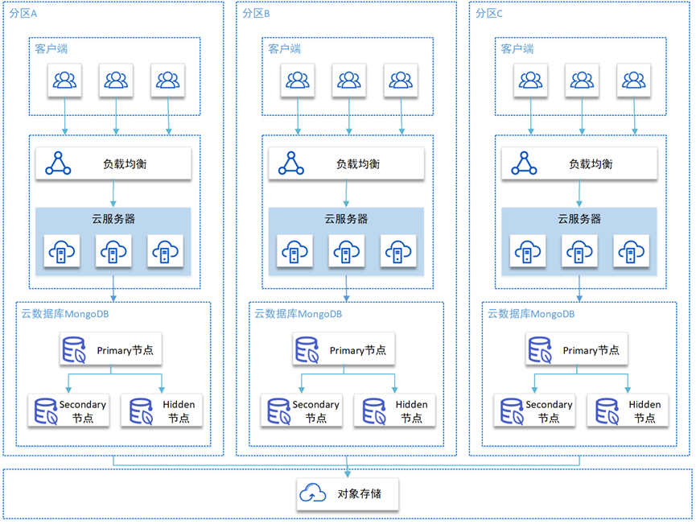
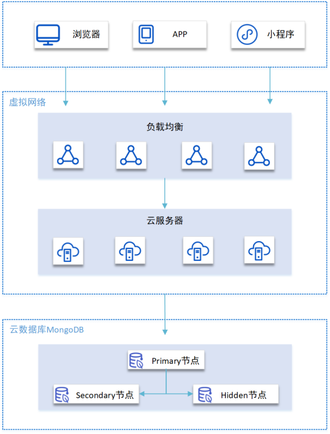
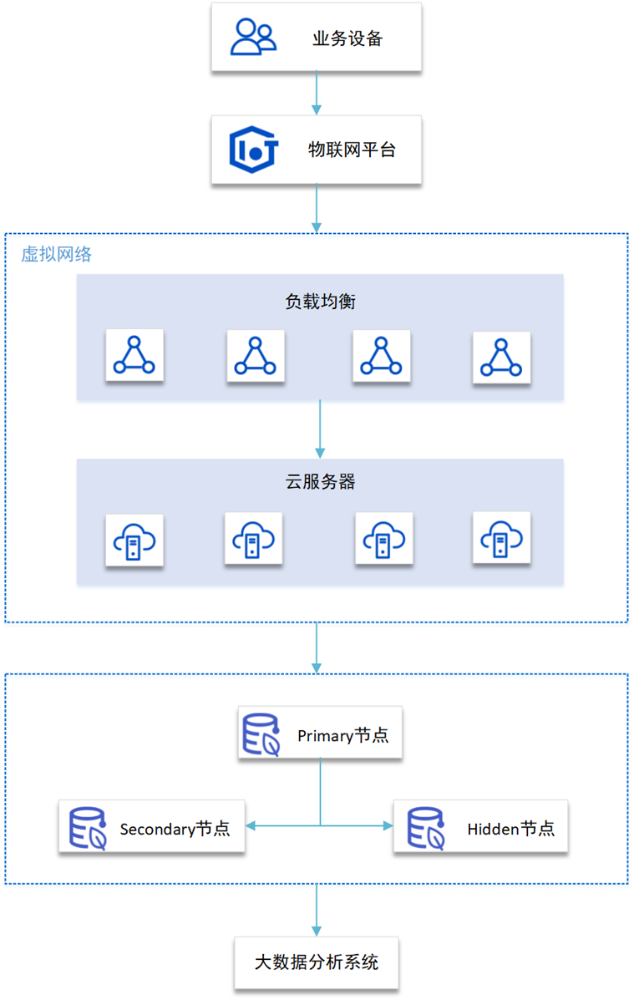

## 游戏场景

使用云数据库MongoDB作为游戏后端数据库，将游戏用户信息、游戏装备、积分等直接以内嵌文档的形式存储，便于业务数据的查询与更新。

## 社交场景

使用云数据库MongoDB可以存储用户信息以及用户发布的社交内容信息，可以通过地理位置索引实现查找附近的人、地点等功能。同时云数据库MongoDB提供了丰富的查询，并且读写数据的速度都较快，非常适用于聊天记录存储场景。

## 物联网场景

物联网领域的终端设备，例如工业传感器、医疗仪器等，可以轻易且持续的产生 TB 级的数据。使用云数据库MongoDB分片集群，可按需配置多个Mongos和Shard节点，实现性能和存储空间的扩展，非常适用于高并发写出的场景，轻松处理物联网海量数据。

## 视频直播场景

使用云数据库MongoDB 可存储视频直播过程中产生的大量的用户信息、礼物信息、聊天信息以及日志等数据，同时可通过丰富的聚合查询来进行业务分析。
