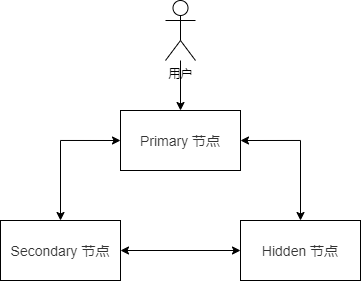
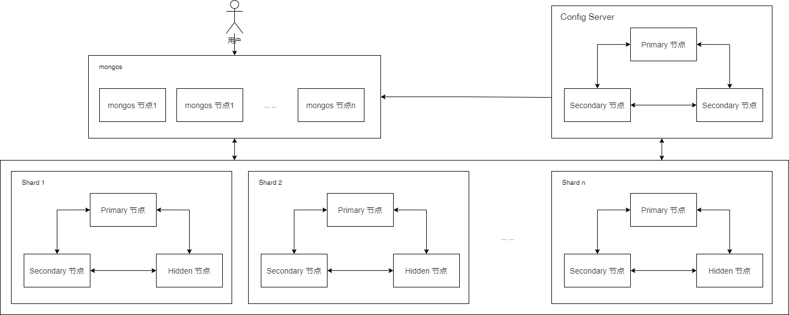

## 副本集

云数据库 MongoDB 副本集采用三节点副本集架构来达到高可用的能力，每一个副本集实例由一个 Primary 节点、一个 Secondary 节点和一个 hidden 节点组成。

- Primary 节点：MongoDB 主节点，负责处理客户端的读写请求。每个副本集架构实例中只能有一个 Primary 节点。
- Secondary 节点：MongoDB 从节点，保存主节点的数据副本，主节点出问题时从节点可提升为新主节点。
- hidden 节点：只用于备份，不处理客户端的读请求。

## 分片集

云数据库 MongoDB 分片集在副本集架构之上，通过多组复制集群组合，实现数据横向拓展。每一个分片集实例由 mongos 节点、Config Server 和 Shard 分片节点组成。

- mongos 节点：负责接收所有客户端的连接查询请求，将请求路由到集群内部对应的分片上，同时会把接收到的响应返回给客户端。您可以购买多个 mongos 节点实现负载均衡及故障迁移。每一个分片集群实例可支持 2-16 个 mongos 节点。
- Config Server 节点：负责存储集群和 Shard 节点的元数据信息，如集群的节点信息、分片数据的路由信息等。ConfigServer 节点规格固定为 1C2G，磁盘空间为 60GB，默认 3 副本集，不可变更配置。
- Shard 节点：负责将数据分片存储在多个服务器上。 您可以购买多个 Shard 节点来横向扩展实例的数据存储和读写并发能力。每一个分片集群实例可支持 2-16 个 Shard 节点。

