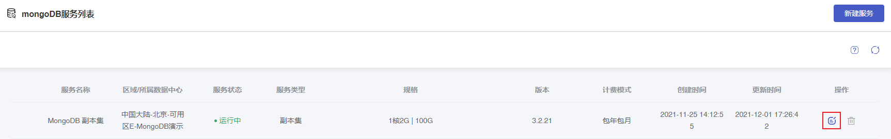
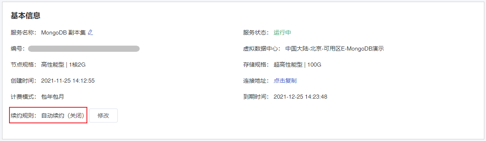
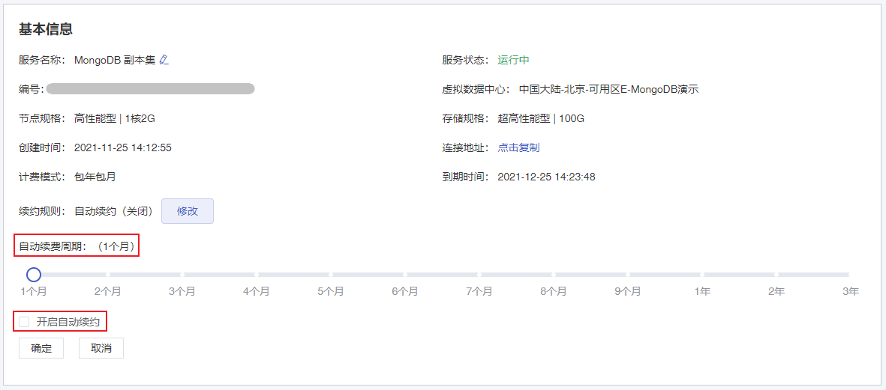
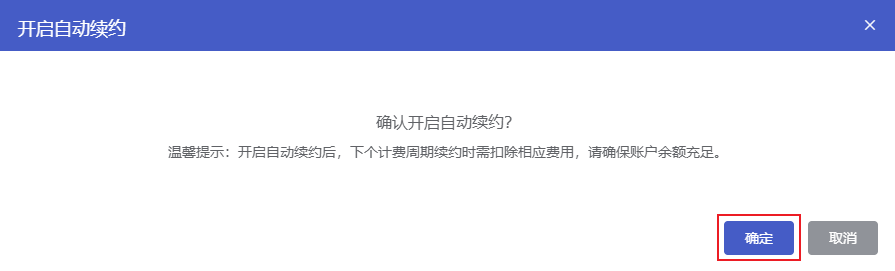
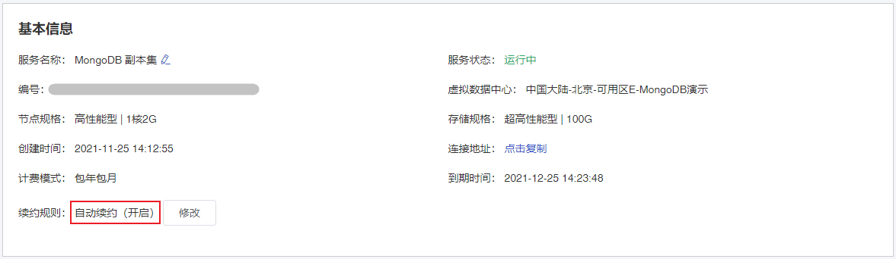

#### 前提条件

仅包年包月计费方式的云数据库 MongoDB 实例支持续费。

#### 操作步骤

包年包月计费方式的云数据库 MongoDB 目前支持自动续约，您可以在控制台查看自动续约是否已开启。未开启自动续约的实例可在控制台开启。

1. 进入 [云数据库 MongoDB 控制台](https://console.capitalonline.net/mongodb)，选择需要续费的实例，在操作中选择 **详情** 进入到实例管理页面。

   

2. 在 **基本信息** 模块中查看续约规格是否已开启自动续约。

   

3. 当实例未开启自动续约时，点击 **修改** 按钮，在当前页面设置自动续费周期并勾选 **开启自动续约**。确认无误后点击 **确定**。

   

4. 在开启自动续约确认弹窗中，点击 **确定** 即可开启自动续约。

   

5. 开启自动续约后，续约规则显示已开启自动续约。

   
