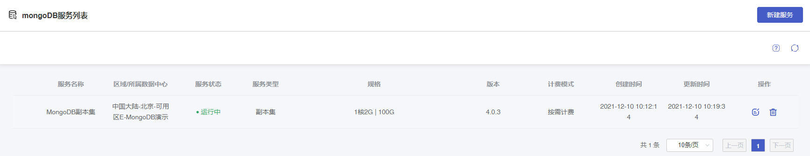
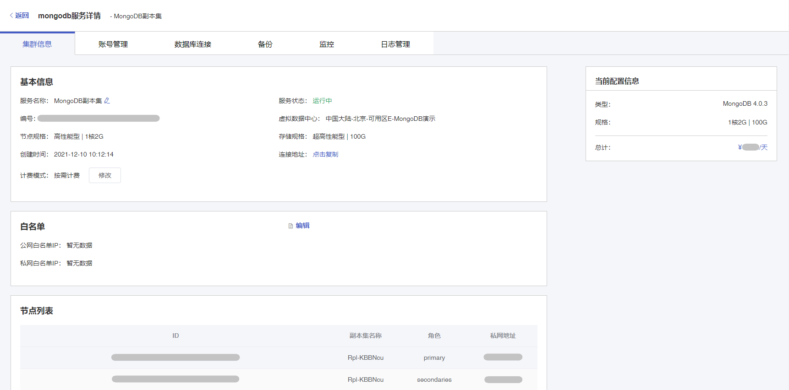

### 操作总览

本文主要介绍云数据库 MongoDB 的控制台操作，通过对实例列表与实例管理页的功能操作讲解，帮助您轻松管理云数据库 MongoDB。

#### 实例列表页

您可以在数据库服务列表页创建 MongoDB 实例，或对创建好的 MongoDB 实例进行管理。

#### 实例管理页

您可以通过点击数据库服务列表页操作 **详情** 按钮进入实例管理页对实例进行查看、监控、管理操作。

| 功能       | 说明                                                         |
| ---------- | ------------------------------------------------------------ |
| 集群信息   | 在集群信息页面，您可以看到 MongoDB 实例的各种信息，您还可以在此页面对实例基本信息进行修改。 |
| 账号管理   | 在账号管理页面，您可以创建或删除 MongoDB 实例的账号，详情参见 [账号管理](./03.账号管理/00.创建账号.md)。 |
| 数据库连接 | 在数据库连接页面，您可以查看 MongoDB 实例的内网连接地址，同时支持申请公网地址并查看。申请公网地址操作，详情参见 [申请公网地址](./02.管理实例/02.申请公网地址.md)。 |
| 备份       | 在备份页面，您可以配置自动备份规则或进行手动备份与恢复实例操作，详情参见 [备份数据库](./05.备份恢复/00.备份数据库.md)。 |
| 监控       | 在监控页面，您可以查看当前实例的各项核心指标，详情参见 [监控功能](./06.监控报警/00.监控功能.md)。 |
| 日志管理   | 在日志管理页面，您可以对 MongoDB 实例的慢日志进行查看与管理。详情参见 [慢日志管理](./07.日志管理/00.日志管理.md)。 |
