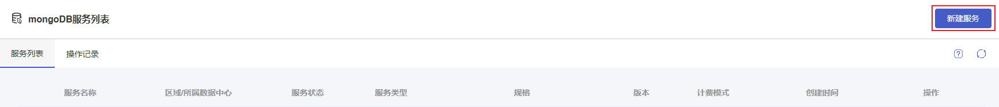
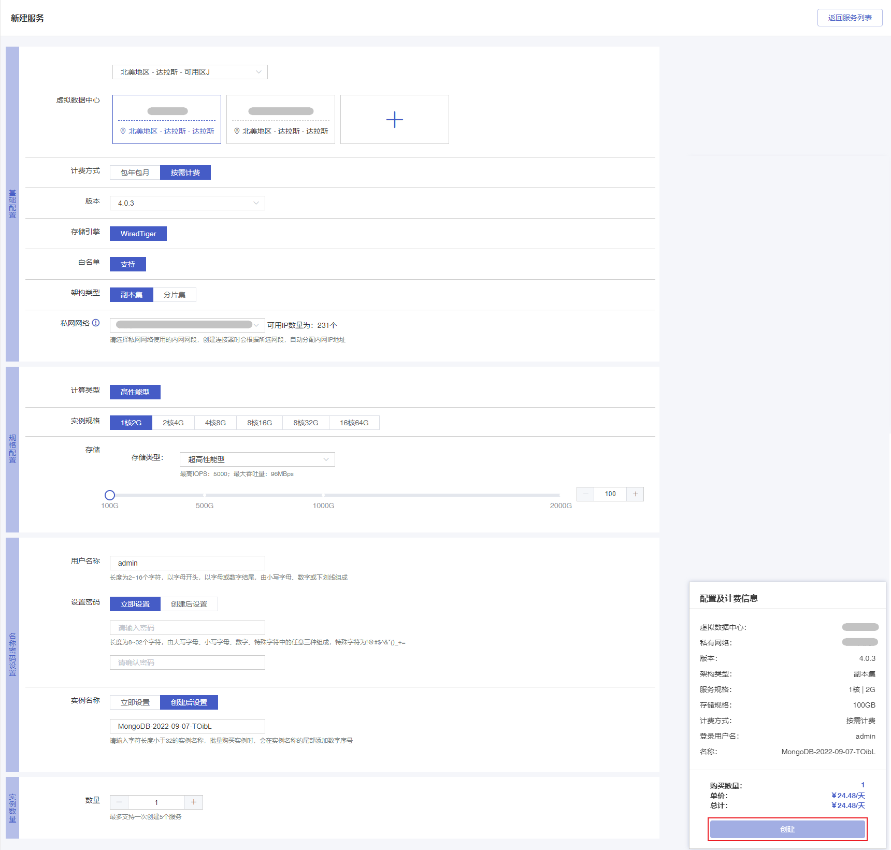
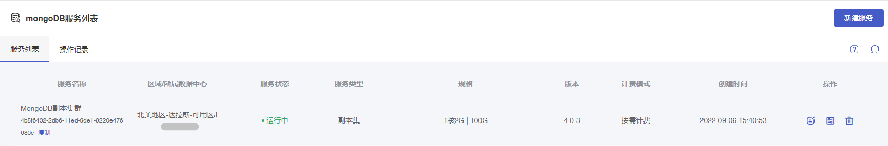

## 前置条件

您已注册首云账号，并已完成身份验证。

## 控制台创建

### 操作步骤

1. 登录 [云数据库 MongoDB 控制台](https://console.capitalonline.net/mongodb)，点击右上角 **新建服务** 进入MongoDB服务创建页面。

2. 根据业务需求配置完以下所有选项后，点击 **创建**。

- **虚拟数据中心**：根据您的业务需要部署 MongoDB 的地域，虚拟数据中心购买后不能更换。请根据目标用户所在的地理位置就近选择地域，提升用户访问速度。请确保云数据库 MongoDB 实例与需要连接的云服务器实例网络可达，否则它们无法通过互通。

- **计费方式**：当前云数据库MongoDB支持**包年包月**和**按需计费**两种模式，详细说明请参见 [计费概述](./00.计费概述.md#计费方式)。

- **版本**：当前云数据库 MongoDB 支持的版本为 3.2.21、3.6.7、4.0.3。

- **存储引擎**：当前云数据库 MongoDB 的默认支持存储引擎 WiredTiger。

- **白名单**：云数据库 MongoDB 默认支持白名单功能，仅允许同一私网网段下的 IP 与在白名单内的 IP 访问 云数据库 MongoDB。

- **架构类型**：当前云数据库 MongoDB 的架构支持**副本集**与**分片集**。

- **私网网络**：云数据库 MongoDB 的私网网段。

- **规格配置**：云数据库 MongoDB 的规格配置。

  - 选择**副本集**架构时，支持所选规格如下：

    计算类型：副本集的计算类型为高性能型。

    实例规格：副本集实例的规格。

    存储：目前仅支持超高性能型存储，默认大小为 100GB，购买步长为 100GB，单块盘最大容量为 2000GB。

  - 选择**分片集**架构时，支持所选规格如下：

    - **Mongos配置**：云数据库 MongoDB 分片集 mongos 的规格配置。

      规格：分片集 mongos 的规格。

      数量：分片集 mongos 的数量，范围为 2-16，默认为 2。

    - **Shard配置**：云数据库 MongoDB 分片集 Shard 的规格配置。

      规格：分片集 Shard 的规格。

      存储：分片集 Shard 的存储大小，默认大小为 100GB，购买步长为 100GB，单块盘最大容量为 2000GB。

      数量：分片集 Shard 的数量，范围为 2-16，默认为 2。

    - **Config配置**：云数据库 MongoDB 分片集 Config Server 的规格配置。

      规格：分片集 Config Server 的规格，默认为 1C2G，不支持修改。

      存储：分片集 Config Server 的存储大小，默认为 60GB，不支持修改。

      数量：分片集 Config Server 的数量，默认为 3 台，不支持修改。

- **用户名称**：云数据库 MongoDB 的账号名称。

- **设置密码**：云数据库 MongoDB 的账号密码，支持立即设置与创建后设置。立即设置的用户在实例创建完成后展示在【账号管理】列表中。创建后设置，则不会创建MongoDB账号。

- **实例名称**：云数据库 MongoDB 实例的名称，支持创建后设置与立即命名。如果选择创建后设置将生成一个默认名称，最长支持 32 个字符。

- **数量**：云数据库 MongoDB 支持批量创建，数量默认为 1，副本集最多支持一次创建 5 个实例，分片集最多支持一次创建 3 个实例。

3. 新创建的云数据库 MongoDB 实例会显示创建中，等待实例显示运行中时，即可开始使用云数据库 MongoDB 实例。

## API创建

通过 API 购买云数据库 MongoDB，详情参见 [创建云数据库MongoDB实例]()。

## 后续操作

如果您在创建实例时未设置用户密码，则需先初始化密码或创建账号，详情参见 [创建账号]()。

如果您在创建实例时已设置用户密码，可以使用内网地址直接访问云数据库MongoDB，详情参见[连接MongoDB实例]()。
