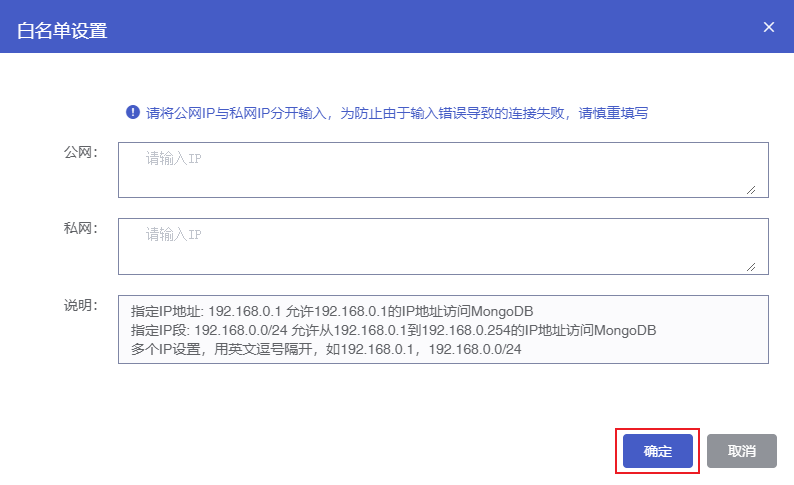
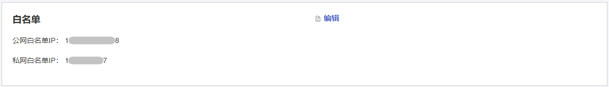
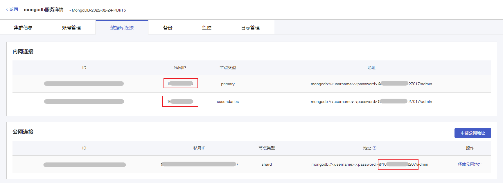

## 白名单配置

未开启白名单时，云数据库 MongoDB 默认仅允许同一私网网段下的 IP 访问，如果需要通过公网或其他私网访问云数据库 MongoDB，您可以通过开启白名单进行配置。

### 操作步骤

1. 进入 [云数据库 MongoDB 控制台](https://console.capitalonline.net/mongodb)，点击数据库服务列表页操作 **详情** 按钮进入实例管理页面，在 **白名单** 模块中，点击 **编辑** 配置公网白名单 IP 与私网白名单 IP。请确保配置的 IP 与云数据库 MongoDB 网络可达。

   

2. 在弹出的窗口中，分别配置公网与私网 IP，支持 IP 地址与 IP 网段，配置 IP 后检查无误，点击 **确定**。

   

   > **注意**：
   >
   > + 与云数据库 MongoDB 处于同一私网网段下的 IP，默认支持访问。
   >
   > + 若添加同一私网网段下的 IP，则其他该私网网段下的 IP 将不能在访问该实例。

3. 添加成功后，您可以在 **白名单** 模块查看到刚才添加的 IP，现在您可以通过云服务器连接 MongoDB。

   

## 查看云数据库 MongoDB 连接地址

### 操作步骤

1. 进入 [云数据库 MongoDB 控制台](https://console.capitalonline.net/mongodb)，点击数据库服务列表页操作 **详情** 按钮进入实例管理页面。

2. 在实例管理页面中基本信息模块，点击连接地址后的 **点击复制** 按钮复制私网连接地址。或点击 **数据库连接** 进入数据库连接详情页面，在 **内网连接** 查看云数据库 MongoDB 私网连接 IP，在 **公网连接** 查看云数据库 MongoDB 公网连接 IP。

   

## shell 连接

### 前置条件

您已成功创建账号。创建 MongoDB 账号操作，详情参见 [创建账号](./../02.账号管理/00.创建账号.md)。如需通过公网访问云数据库 MongoDB，您需要申请公网地址，详情参见 [申请公网地址](./02.申请公网地址.md)。

### 操作步骤

1. 登录云服务器，在您的云服务器中下载与云数据库 MongoDB 实例版本相同的 MongoDB 客户端。MongoDB 客户端下载地址：[MongoDB Community Server](https://www.mongodb.com/try/download/community)。输入以下命令下载 MongoDB shell。

   ```
   wget wget https://fastdl.mongodb.org/linux/mongodb-shell-linux-x86_64-XXXXX-X.X.X.tgz
   ```

5. 使用 `tar` 命令解压下载的 MongoDB Shell 的安装包。

   ```
   tar zxvf mongodb-shell-linux-x86_64-XXXXX-X.X.X.tgz
   ```

6. 使用 `cd` 命令，进入到解压后的目录。

   ```
   cd mongodb-shell-linux-x86_64-XXXXX-X.X.X/
   ```

7. 执行以下命令，连接云数据库 MongoDB 实例。

   ```
   ./bin/mongo -uusername -ppassword 10.xx.xx.xx:27017/admin
   ```

   ###### 参数说明

   + -u：云数据库 MongoDB 的账号名称。
   + -p：云数据库 MongoDB 的账号密码。
   + 10.xx.xx.xx:27017：云数据库 MongoDB 的连接地址与端口号，在 [云数据库 MongoDB 控制台](https://console.capitalonline.net/mongodb) 可查看云数据库 MongoDB 的连接地址。

8. 连接成功后提示信息如下所示。

   ```
   MongoDB shell version v4.0.27
   connecting to: mongodb://10.xx.xx.xx:27017/admin?gssapiServiceName=mongodb
   Implicit session: session { "id" : UUID("**********************") }
   MongoDB server version: 4.0.3
   ```

   > **说明**：
   >
   > - 副本集实例：您可以连接 Primary 节点或 Secondary 节点的连接地址。
   >   Primary 节点：副本集实例中的主节点，连接该节点可执行数据库的读写操作。
   >   Secondary 节点：副本集实例中的从节点，连接该节点仅能执行数据库的读操作。
   > - 分片集实例： 您可以连接任意一 mongos 节点的连接地址。

## URI 连接

### 前置条件

+ 您已成功创建账号。创建 MongoDB 账号操作，详情参见 [创建账号](./../02.账号管理/00.创建账号.md)。
+ 准备多语言 SDK 运行环境 。

### URL 连接示例

```
mongodb://username:password@IP:27017/admin
```

```
mongodb://username:password@IP:27017/somedb?authSource=admin
```

```
mongodb://username:password@IP:27017/somedb?authSource=admin&readPreference=secondaryPreferred
```

#### 参数说明

| 参数                              | 说明                                          | 是否必须 |
| :-------------------------------- | :-------------------------------------------- | :------- |
| mongodb://                        | 一个特定的字符串，表示 MognoDB 协议           | 是       |
| username                          | 用于登录 MongoDB 的账号名称                   | 是       |
| password                          | 用于登录 MongoDB 的账号密码                   | 是       |
| hostX:27017                       | MongoDB 的 IP 和端口                          | 是       |
| /admin                            | 要认证的数据库，云数据库 MongoDB 固定为 admin | 是       |
| authMechanism=MONGODB-CR          | 认证机制                                      | 是       |
| authSource=admin                  | 身份认证所用库，云数据库 MongoDB 固定为 admin | 是       |
| readPreference=secondaryPreferred | 可以设置优先读从库                            | 是       |

> **注意**：
>
> 连接云数据库 MongoDB 最低驱动版本需要 3.2 版本，建议使用最新版的客户端驱动以保证最好的兼容性，包括 Shell 套件、Java jar 包、PHP 扩展、Node.js 模块等，具体请参见 [MongoDB 驱动](https://docs.mongodb.com/ecosystem/drivers/)。

云数据库 MongoDB 支持的多个语言 SDK 的示例如下，您可以根据示例拼接 URI，并连接数据库进行读写操作。

- [shell连接示例](./../../09.SDK参考/00.shell连接示例.md)
- [PHP连接示例](./../../09.SDK参考/01.PHP连接示例.md)
- [Node.js连接示例](./../../09.SDK参考/02.Node.js连接示例.md)
- [Java连接示例](./../../09.SDK参考/03.Java连接示例.md)
- [Python连接示例](./../../09.SDK参考/04.Python连接示例.md)
- [Go连接示例](./../../09.SDK参考/05.Go连接示例.md)
- [PHP重连机制](./../../09.SDK参考/06.PHP重连机制.md)
