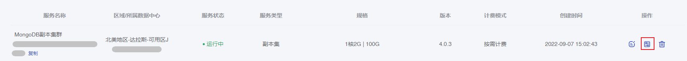
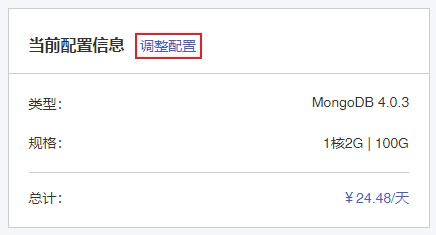
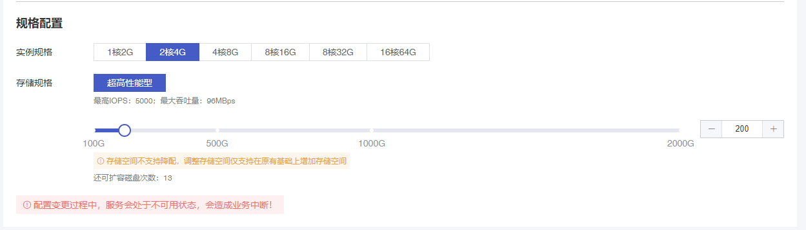
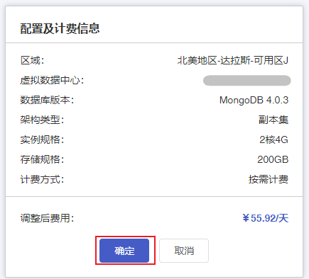

## 操作场景

根据实际业务情况，您可以在[控制台](https://console.capitalonline.net/mongodb_v2)灵活变更MongoDB实例的规格和存储空间，既能使实例规格配置与业务需求更匹配，又能够让云数据库资源得到充分利用。

> 注意：
>
> - 目前仅MongoDB副本集支持变更配置。
> - MongoDB存储空间不支持降配，调整存储空间仅支持在原有基础上增加存储空间。
> - 变更配置过程需重启服务，此期间服务不可用，会造成连接中断。**建议您在业务低峰期执行该操作。**

## 操作步骤

1. 登录 [云数据库 MongoDB 控制台](https://console.capitalonline.net/mongodb)。
- 在实例列表中选择需要变更配置的MongoDB实例，点击操作列的**调整配置**图标，进入配置变更页面。

- 点击操作列的**详情**图标进入实例管理页面。在【集群信息】页面的**配置信息**区域，点击**调整配置**，进入配置变更页面。

2. 在变更配置页面，选择需要调整的实例规格和存储规格。

3. 核对配置及计费信息后点击**确定**。

## 费用说明

详情参见[调整规格实例费用说明](./../../03.购买指南/05.调整实例规格费用说明.md)。

