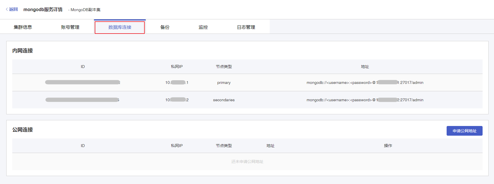
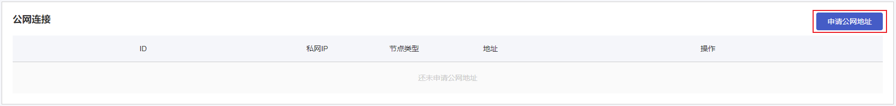
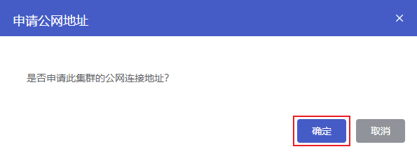
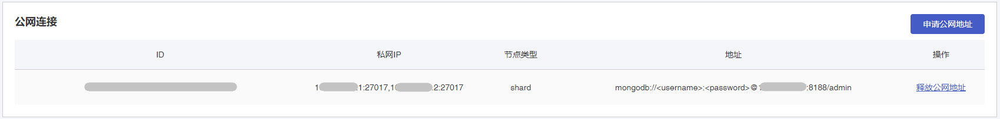

## 操作场景

在您新创建完一个云数据库 MongoDB 实例后，您需要创建一个或多个 MongoDB 用户账号，用于访问您的 MongoDB 数据库。

## 前置条件

+ 您已成功创建 MongoDB 实例，实例状态为运行中。创建实例步骤详情参见 [创建实例](./../../04.操作指南/02.管理实例/00.创建实例.md)。
+ 您的云数据库 MongoDB 实例所属的虚拟数据中心有可用公网 IP。

## 操作步骤

1. 进入 [云数据库 MongoDB 控制台](https://console.capitalonline.net/mongodb)，点击数据库服务列表页操作 **详情** 按钮进入实例管理页面。

2. 点击 **数据库连接** 进入数据库连接详情页面。

   

3. 在 **公网连接** 模块，点击 **申请公网地址**。

   

4. 在弹出的窗口中，点击 **确认**。

   

5. 申请完成后，在 **公网连接** 模块列表中显示公网 IP 地址，您可以使用该公网地址用来连接云数据库 MongoDB。在您不需要公网地址时，可以在操作中释放公网地址。

   
