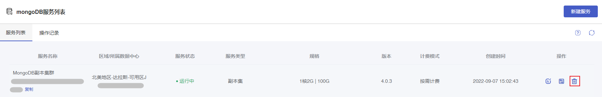
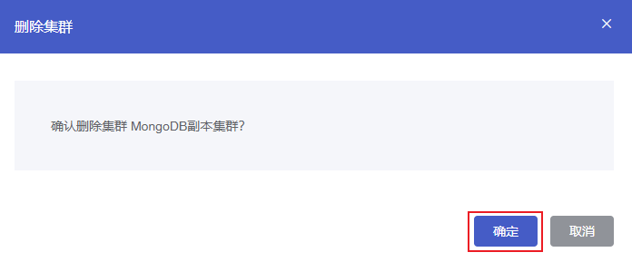

## 操作场景

根据实际业务需要，您可以在[控制台](https://console.capitalonline.net/mongodb) 删除MongoDB实例。

- 按需计费的实例手动删除后，实例将无法访问且IP资源同时释放。
- 包年包月的实例未开启自动续约的情况下，实例到期后将进入1天缓冲期，期间实例可以正常访问。缓冲期结束后实例将关机，此时实例将无法访问。关机2天后，实例将自动删除且IP资源同时释放。在缓冲期间或关机期间，如果您想继续使用实例，可以进行**续费开机**，详情参见[续费说明](./../../03.购买指南/03.续费说明.md)。

实例删除后，将不再产生与该实例相关的费用。

> **注意**：
>
> 实例彻底销毁后数据无法恢复，请提前备份实例数据以防数据丢失。

## 控制台删除

### 操作步骤

1. 进入 [云数据库 MongoDB 控制台](https://console.capitalonline.net/mongodb)，在实例列表中选择需要终止的实例，在操作列点击 **删除** 按钮。

   

2. 在弹出的窗口中，点击**确定** 即可删除当前的MongoDB实例。

   

## API删除

通过 API 删除云数据库 MongoDB 实例，详情参见 [删除云数据库MongoDB实例](./../08.API文档/02.实例相关接口/06.删除云数据库MySQL实例.md)。
