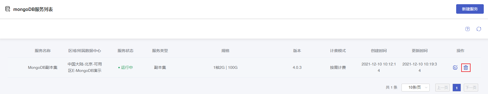
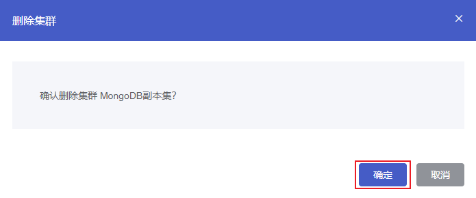

#### 操作场景

根据您的业务需求，您可以在 [云数据库 MongoDB 控制台](https://console.capitalonline.net/mongodb) 终止实例。终止实例后，实例一旦删除时，将不再产生与该实例相关的费用。

> **注意**：
>
> 实例彻底销毁后数据无法恢复，请提前备份实例数据以防数据丢失。

#### 控制台删除

##### 操作步骤

1. 进入 [云数据库 MongoDB 控制台](https://console.capitalonline.net/mongodb)，在实例列表中选择要终止的实例，在操作列点击 **删除** 按钮。

   

2. 在弹出的窗口中，单击 **确定** 即可删除云数据库 MongoDB 实例。

   

#### API删除

通过 API 删除云数据库 MongoDB 实例，详情参见 [删除云数据库MongoDB实例](./../08.API文档/02.实例相关接口/06.删除云数据库MySQL实例.md)。
