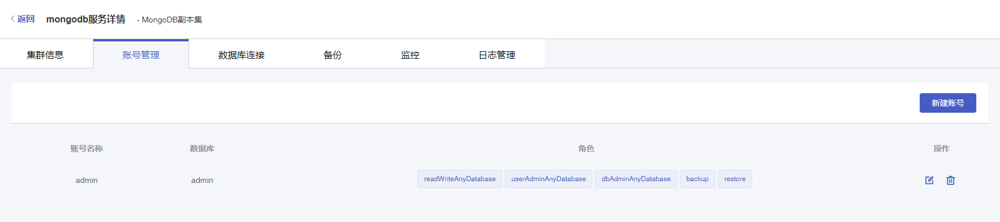

#### 操作场景

在您新创建完一个云数据库 MongoDB 实例后，您需要创建一个或多个 MongoDB 用户账号，用于访问您的 MongoDB 数据库。

#### 前置条件

您已成功创建 MongoDB 实例，实例状态为运行中。创建实例步骤详情参见 [创建实例](./../../04.操作指南/02.管理实例/00.创建实例.md)。

#### 操作步骤

1. 进入 [云数据库 MongoDB 控制台](https://console.capitalonline.net/mongodb)，点击数据库服务列表页操作 **详情** 按钮进入实例管理页面，点击 **账号管理** 查看账号列表。

2. 点击 **新建账号** 按钮，弹出创建账号窗口。

   

3. 在创建账号弹窗中，根据提示填写以下所有信息。

   | 配置项   | 说明                                                         |
   | -------- | ------------------------------------------------------------ |
   | 账号名称 | MongoDB 实例的账号名称。  长度为2~16个字符，以字母开头，以字母或数字结尾，由小写字母、数字或下划线组成。 |
   | 密码     | MongoDB 实例的账号密码。 长度为8~32个字符，由大写字母、小写字母、数字、特殊字符中的任意三种组成，特殊字符为!@#$^&*()_+= |
   | 确认密码 | 二次确认密码，确保两次密码相同即可。                         |

4. 确认输入内容无误后，点击 **确定** 即可创建 MongoDB 实例账号。

   

5. 创建成功后，账号列表将显示您刚才创建的账号。现在您可以通过创建好的账号访问您的 MongoDB 数据库。

   

   > **说明**：
   >
   > 当前仅支持默认账号权限

#### 后续操作

通过 MongoDB shell 等方式访问数据库，详情参见 [连接实例](./../02.管理实例/01.连接实例.md)。
