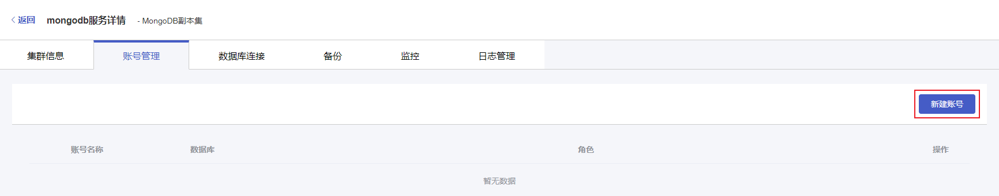
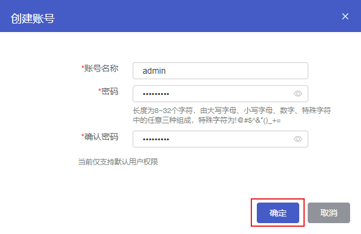

## 操作场景

在您新创建完一个云数据库 MongoDB 实例后，您需要创建一个或多个 MongoDB 用户账号，用于访问您的 MongoDB 数据库。

## 前置条件

您已成功创建 MongoDB 实例，实例状态为运行中。创建实例步骤详情参见 [创建实例](./../../04.操作指南/02.管理实例/00.创建实例.md)。

## 操作步骤

1. 登录 [云数据库 MongoDB 控制台](https://console.capitalonline.net/mongodb_v2)，点击实例列表操作列的**详情**图标进入实例管理页面。

1. 点击**账号管理**进入账号管理页面。

2. 点击**新建账号**，打开创建账号弹窗。

   

4. 在创建账号弹窗中，设置账号信息。确认输入内容无误后，点击 **确定** 即可创建 MongoDB 用户账号。

   

   | 配置项   | 说明                                                         |
   | -------- | ------------------------------------------------------------ |
   | 账号名称 | MongoDB 实例的账号名称。  长度为2~16个字符，以字母开头，以字母或数字结尾，由小写字母、数字或下划线组成。 |
   | 密码     | MongoDB 实例的账号密码。 长度为8~32个字符，由大写字母、小写字母、数字、特殊字符中的任意三种组成，特殊字符为!@#$^&*()_+= |
   | 确认密码 | 二次确认密码，确保两次密码相同即可。                         |

   > **说明**：
   >
   > 云数据库MongoDB实例用户仅支持默认用户权限。默认用户权限范围如下:
   >
   > | 角色                 | 权限                                                         |
   > | -------------------- | ------------------------------------------------------------ |
   > | backup               | 备份当前实例所有库。                                         |
   > | restore              | 从备份文件中恢复当前实例所有数据。                           |
   > | readWriteAnyDatabase | 读写当前实例所有库中的数据。                                 |
   > | dbAdminAnyDatabase   | 当前实例所有库的dbAdmin权限，可以对所有库进行读取、清理、修改、压缩、获取统计信息、执行检查等操作。 |
   > | userAdminAnyDatabase | 在当前实例所有库下创建和修改用户。                           |

## 后续操作

使用账号和密码连接云数据库MongoDB，详情参见[连接实例](./../02.管理实例/01.连接实例.md)。
