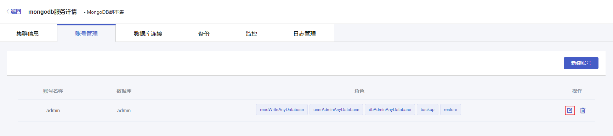

#### 操作场景

在使用云数据库 MongoDB 过程中，如果您需要修改数据库账号密码，可以通过控制台重新设置密码。

#### 前置条件

您已成功创建 MongoDB 实例，实例状态为运行中。创建实例步骤详情参见 [创建实例](./../../04.操作指南/02.管理实例/00.创建实例.md)。

#### 操作步骤

1. 进入 [云数据库 MongoDB 控制台](https://console.capitalonline.net/mongodb)，点击数据库服务列表页操作 **详情** 按钮进入实例管理页面，点击 **账号管理** 查看账号列表。

2. 选择需要修改密码账号，点击操作中的 **修改密码** 按钮，弹出修改密码窗口。

   

3. 在修改密码弹窗中，根据提示填写以下所有信息。

   | 配置项   | 说明                                                         |
   | -------- | ------------------------------------------------------------ |
   | 老密码   | MongoDB 实例账号的旧密码。                                   |
   | 新密码   | MongoDB 实例账号的新密码。 长度为8~32个字符，由大写字母、小写字母、数字、特殊字符中的任意三种组成，特殊字符为!@#$^&*()_+= |
   | 确认密码 | 二次确认密码，确保两次密码相同即可。                         |

4. 确认输入内容无误后，点击 **确定** 即可修改 MongoDB 实例账号密码。

   

5. 修改成功后，您可以通过新的账号密码访问您的 MongoDB 数据库。

   

