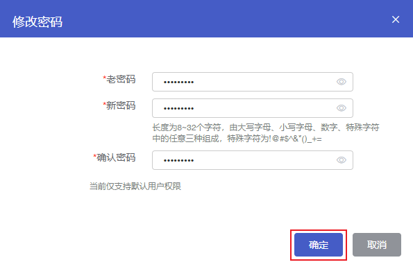

## 操作场景

在使用云数据库 MongoDB 过程中，如果您需要修改数据库账号密码，可以通过控制台重新设置密码。

## 操作步骤

1. 登录 [云数据库 MongoDB 控制台](https://console.capitalonline.net/mongodb_v2)，点击实例列表操作列的**详情**图标进入实例管理页面。

2. 点击**账号管理**进入账号管理页面。

2. 在账号列表中找到需要修改密码的账号，点击**修改密码**图标 。

   

4. 在修改密码弹窗中，修改账号的密码，点击**确认**。

   

   | 配置项   | 说明                                                         |
   | -------- | ------------------------------------------------------------ |
   | 老密码   | MongoDB 实例账号的旧密码。                                   |
   | 新密码   | MongoDB 实例账号的新密码。 长度为8~32个字符，由大写字母、小写字母、数字、特殊字符中的任意三种组成，特殊字符为!@#$^&*()_+= |
   | 确认密码 | 二次确认密码，确保两次密码相同即可。                         |

> 注意：
>
> - 修改密码后，正在使用原账号密码访问MongoDB的连接不会断开，新建连接需使用新密码访问。

