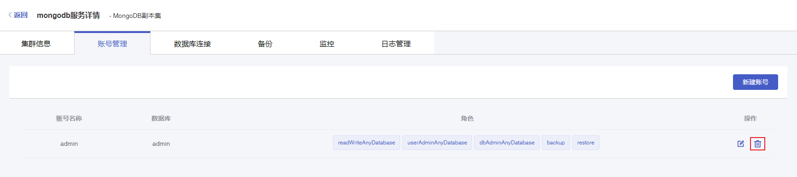
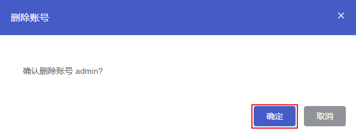

## 操作场景

若您需要对已创建的数据库账号进行停用，可以通过控制台 删除数据库账号。

> **注意**：
>
> - 数据库账号删除后不可恢复，请谨慎操作。
> - 为了避免因账号误删除而影响业务的正常使用，请确认要删除的数据库账号没有提供使用。

## 操作步骤

1. 登录 [云数据库MongoDB控制台](https://console.capitalonline.net/mongodb_v2)，点击实例列表操作列的**详情**图标进入实例管理页面。

2. 点击**账号管理**进入账号管理页面。

2. 在账号列表中找到需要删除的账号，点击**删除**图标。

   

3. 点击**确定**按钮即可删除数据库账号。

   

> 注意：
>
> - 删除账号后，正在使用当前账号密码访问MongoDB的连接不会断开，新建连接将无法使用该账号访问。
