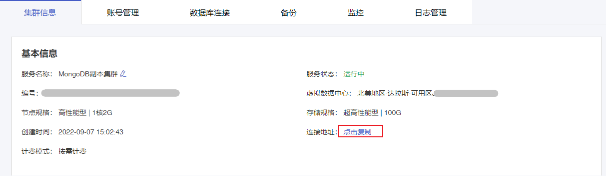
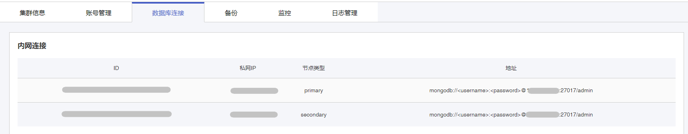

## 操作场景

云数据库MongoDB实例支持内网访问方式。您可以使用高可用的内网连接地址访问云数据库MongoDB实例。

## 操作步骤

### 方式1

1. 登录 [云数据库MongoDB控制台](https://console.capitalonline.net/mongodb_v2)，点击实例列表操作列的**详情**图标进入实例管理页面。
2. 在【集群信息】页面的**基本信息**栏找到连接地址。点击**复制**按钮即可复制高可用连接地址。



> 示例如下：
>
> ```
> mongodb://<username>:<password>@10.XXX.XXX.1:27017,10.XXX.XXX.2:27017/admin
> ```

### 方式2

1. 登录 [云数据库MongoDB控制台](https://console.capitalonline.net/mongodb_v2)，点击实例列表操作列的**详情**图标进入实例管理页面。
2. 点击**数据库连接**进入数据库连接管理页面。



- MongoDB副本集

显示MongoDB副本集的Primary节点和Secondary节点的连接地址。

> 说明：
>
> Primary 节点：副本集实例中的主节点，连接该节点可执行数据库的读写操作。
>
> Secondary 节点：副本集实例中的从节点，当主节点故障时，从节点自动接管业务，保证实例能够正常连接。

- MongoDB分片集

显示MongoDB分片集的Mongos节点的连接地址。

> 说明：
>
> Mongos节点负责处理所有客户端的连接请求。可以连接任意一个 Ｍongos 节点的连接地址，也可以同时连接多个Mongos节点的连接地址保障连接的高可用。

## 后续操作

使用内网地址连接云数据库MongoDB，详情参见[连接实例](./../02.管理实例/01.连接实例.md)。
