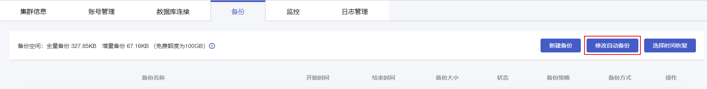
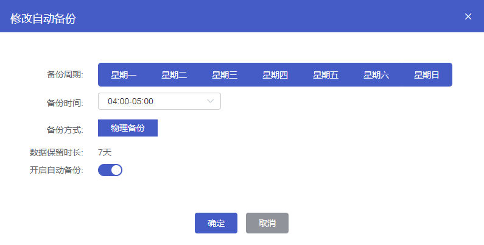

## 自动备份说明

数据备份用于数据损坏或丢失情况下的数据库恢复。云数据库MongoDB默认定期对实例的数据进行物理备份，生成的备份文件免费保留7天，支持在备份列表中查看当前保留的备份文件。您可以根据实际需求调整自动备份策略，您也可以自行关闭或开启自动备份功能，开启自动备份后，云数据库MongoDB将根据设置的备份策略自动备份数据。

> **说明**：
>
> - 备份属于热备份，云数据库MongoDB实例不需要停机，对您的线上业务没有影响。
> - 备份在云数据库MongoDB的隐藏节点（Hidden）进行，不影响主节点（Primary）的读写性能。
> - 若数据量较大，备份花费的时间可能较长，请耐心等待。

## 操作步骤

1. 进入 [云数据库 MongoDB 控制台](https://console.capitalonline.net/mongodb_v2)，点击实例列表操作列的**详情**图标进入实例管理页面。

1. 点击**备份**进入备份页面。

3. 点击**修改自动备份**按钮，打开修改自动备份弹窗。

   

4. 在修改自动备份弹窗中，设置自动备份策略。

   

   参数说明如下：

   | 参数         | 说明                                                         |
   | ------------ | ------------------------------------------------------------ |
   | 备份周期     | 可以设置为一星期中的某一天或某几天，默认每天备份一次。       |
   | 备份时间     | 可设置为一天中的任意整点时段，以小时为单位，建议设置为业务低峰期时间。 |
   | 备份方式     | 备份方式为物理备份，将会备份整个数据库实例。                 |
   | 数据保留时长 | 数据备份文件保留的天数，默认为7天，不可更改。                |
   | 开启自动备份 | 可以设置自动备份是否开启，默认开启。                         |

4. 配置完成后，点击**确定**，实例将按照设置的备份策略自动执行备份任务。

## 费用说明

云数据库MongoDB提供提供免费备份额度，免费额度与实例存储空间大小一致。备份文件（包括全量备份和增量备份）容量未超过免费额度，备份不收费。超过免费额度后，**每小时备份费用=（备份文件容量-免费额度）*备份单价**。备份费用，请参见[云数据库MongoDB备份空间费用](./../../../03.购买指南/01.产品定价.md#备份空间费用)。
