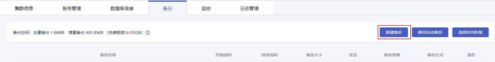
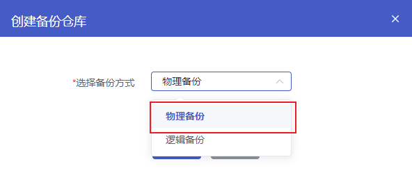
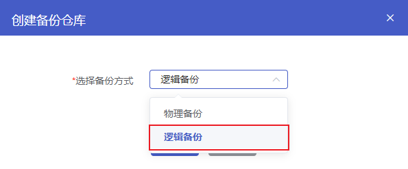

## 手动备份说明

云数据库MongoDB可以根据实际业务需要手动创建备份文件。手动备份时支持的备份方式有物理备份和逻辑备份，生成的备份文件免费保留7天。

- 物理备份

- 备份MongoDB实例中数据库相关的物理文件。

- 逻辑备份

  使用mongodump工具将数据库的操作日志存储到逻辑备份文件中。恢复时通过回放命令的形式还原数据。

> **说明**：
>
> - 目前副本集同时支持物理备份和逻辑备份，分片集仅支持物理备份。
> - 备份属于热备份，云数据库MongoDB实例不需要停机，对您的线上业务没有影响。
> - 备份都在云数据库MongoDB的隐藏节点（Hidden）进行，不影响主节点（Primary）的读写性能。
> - 若数据量较大，备份花费的时间可能较长，请耐心等待。

## 操作步骤

### 物理备份

1. 进入 [云数据库 MongoDB 控制台](https://console.capitalonline.net/mongodb_v2)，点击实例列表操作列的**详情**图标进入实例管理页面。
2. 点击**备份**进入备份页面。
3. 点击**新建备份**按钮，打开手动创建备份弹窗。

4. 在创建备份弹窗中，备份方式选择**物理备份**。

5. 点击**确定**，实例将立即执行物理备份任务。

### 逻辑备份

1. 进入 [云数据库 MongoDB 控制台](https://console.capitalonline.net/mongodb_v2)，点击实例列表操作列的**详情**图标进入实例管理页面。
2. 点击**备份**进入备份页面。
3. 点击**新建备份**按钮，打开手动创建备份弹窗。

4. 在创建备份弹窗中，备份方式选择**逻辑备份**。

5. 点击**确定**，实例将立即执行逻辑备份任务。

## 费用说明

云数据库MongoDB提供提供免费备份额度，免费额度与实例存储空间大小一致。备份文件（包括全量备份和增量备份）容量未超过免费额度，备份不收费。超过免费额度后，**每小时备份费用=（备份文件容量-免费额度）*备份单价**。备份费用，请参见[云数据库MongoDB备份空间费用](./../../../03.购买指南/01.产品定价.md#备份空间费用)。
