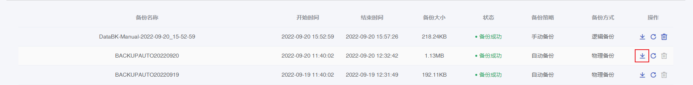
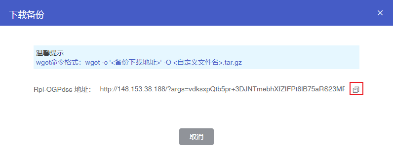

## 操作场景

如果您希望长时间保留云数据库MongoDB的备份数据，您可以下载备份文件至本地或首云的云服务器中进行存储。您也可以将备份文件恢复至其他数据库中，用于业务测试等场景。

## 操作步骤

1. 进入 [云数据库 MongoDB 控制台](https://console.capitalonline.net/mongodb_v2)，点击实例列表操作列的**详情**图标进入实例管理页面。
2. 点击**备份**进入备份页面。
3. 在备份列表中选择需要下载的备份文件，点击**下载**，打开下载备份弹窗。



4. 在下载备份弹窗中，复制公网地址下载备份文件。



- 本地下载（Windows系统）

  复制公网下载地址，将地址粘贴至浏览器地址栏，按`Enter`键即可将备份文件下载到本地电脑。

- 云服务器下载（Linux系统）

  在开通公网的云服务器上执行下述格式的命令：

  ```
  wget命令格式：wget -c '<备份下载地址>' -O <自定义文件名>.tar.gz
  ```

  
