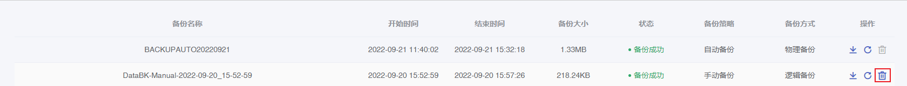
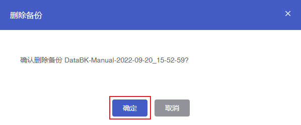

## 操作场景

云数据库MongoDB的备份文件默认保留7天，7天后将自动删除。手动备份文件在保留期间也支持您根据实际情况自行删除。

## 操作步骤

1. 进入 [云数据库 MongoDB 控制台](https://console.capitalonline.net/mongodb_v2)，点击实例列表操作列的**详情**图标进入实例管理页面。
2. 点击**备份**进入备份页面。
3. 在备份列表中选择需要删除的备份文件，点击**删除**，打开删除备份提示框。

4. 在提示框中，点击**确定**，删除当前备份文件。

> **注意**：
>
> 删除后的备份文件无法恢复，如需保留可先将备份下载至本地。
