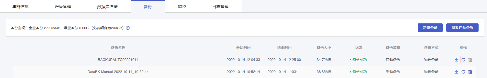
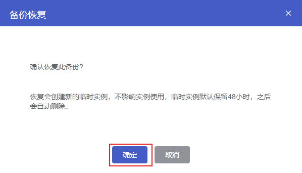

## 操作场景

云数据库MongoDB支持基于物理备份文件恢复实例，通过将备份数据恢复到临时实例，再将临时实例转正的方式创建一个新实例，新实例中的数据与备份文件一致，可用于数据恢复或快速部署业务等场景。

## 前置条件

MongoDB实例已完成物理备份，备份操作详情参见[自动物理备份](./../../../04.操作指南/05.备份与恢复/00.备份数据/00.自动备份.md)或[手动物理备份](./../../../04.操作指南/05.备份与恢复/00.备份数据/01.手动备份.md#物理备份)。

## 操作步骤

1. 进入 [云数据库 MongoDB 控制台](https://c2.capitalonline.net/gic/MongoDB_V2)，点击数据库服务列表页操作 **详情** 按钮进入实例管理页面，点击**实例名称**进入实例管理页面。
2. 点击**备份**进入备份页面。
3. 在备份列表中选择需要恢复的备份数据，点击操作**备份恢复**按钮，打开备份恢复弹窗。

4. 在备份恢复弹窗中，点击**确定**，实例将基于当前物理备份文件立即执行备份恢复任务。

5. 恢复完成后，该实例将基于备份文件创建出一个临时实例。

> **说明**：
>
> - 临时实例为免费实例，用于存放恢复的数据，临时实例的用户名和密码与原实例一致。原实例保持不变，不会对业务造成影响。
> - 每个实例仅支持恢复出一个临时实例，临时实例默认保留48小时，超时后将自动删除。

6. 点击临时实例操作列的**转正**，即可将临时实例转为独立于原实例的正式实例。

> 说明：
>
> 临时实例转为正式实例后，该实例将按云数据库MongoDB收费标准进行收费。

7. 点击临时实例操作列的**删除**，即可删除当前临时实例。

- **转正**：将临时实例转为独立于原实例的正式实例，供业务使用，按原实例收费标准收费。
- **删除**：删除该临时实例。
