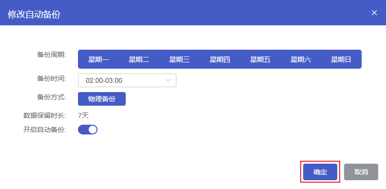

## 操作场景

数据备份用于数据损坏或丢失情况下的数据库恢复，您可以设置备份策略来自动备份或手动备份，自动备份的方式为物理备份，手动备份支持物理备份与逻辑备份。

## 备份简介

### 备份方式

云数据库 MongoDB 支持 **自动备份** 和 **手动备份** 两种方式来备份数据库。

### 备份类型

云数据库 MongoDB 支持 **物理备份** 与 **逻辑备份**，物理备份支持自动备份和手动备份，逻辑备份支持手动备份。

> **注意**：
>
> - 备份属于热备份，服务实例不需要停机，对您的线上业务没有影响。
> - 请尽量选择业务低峰期进行备份。
> - 若数据量较大，花费的时间可能较长，请耐心等待。

### 自动备份

#### 操作步骤

1. 进入 [云数据库 MongoDB 控制台](https://console.capitalonline.net/mongodb)，点击数据库服务列表页操作 **详情** 按钮进入实例管理页面，点击 **备份** 查看备份列表。

2. 点击 **修改自动备份** 按钮，弹出自动备份配置窗口。

   

3. 在自动备份配置窗口设置自动备份策略，参数说明如下：

   | 参数         | 说明                                                         |
   | ------------ | ------------------------------------------------------------ |
   | 备份周期     | 可以设置为一星期中的某一天或某几天。                         |
   | 备份时间     | 可设置为一天中的任意整点时段，以小时为单位，建议设置为业务低峰期时间。 |
   | 备份方式     | 备份方式为物理备份，将会备份整个数据库实例。                 |
   | 数据保留时长 | 数据备份文件保留的天数，默认为7天                            |
   | 开启自动备份 | 可以设置自动备份是否开启，默认开启                           |

4. 配置完成后，点击 **确定** 即可。

   

### 手动备份

#### 操作步骤

1. 进入 [云数据库 MongoDB 控制台](https://console.capitalonline.net/mongodb)，点击数据库服务列表页操作 **详情** 按钮进入实例管理页面，点击 **备份** 查看备份列表。

2. 点击 **新建备份** 按钮，弹出创建备份窗口。

   

3. 在创建备份窗口选择备份方式，支持选择物理备份与逻辑备份。选择完成后，点击 **确定** 即可。

   > **注意**：备份保留天数跟随自动备份设置的保留天数

   

## 常见问题

### 1.超出备份保留时间的备份还能保留及使用吗？

超出保留时间的备份会被删除，无法继续使用，建议您设置合理备份策略，或使用手动备份，手动备份会一直保存。

### 2.我可以删除备份吗？

- 自动备份不支持手动删除，超出设置的数据保留时长时会自动删除。
- 手动备份可以在备份列表中点击 **删除** 进行删除，如不删除则会一直保留，详情参见 [删除备份](https://github.com/capitalonline/cds-document/blob/dev/数据库服务/MySQL/04.操作指南/07.备份恢复/02.删除备份.md)。

### 3.我可以关闭自动备份吗？

您可以通过编辑备份策略，点击 **开启自动备份** 开关进行关闭数据自动备份操作。

## 备份保留时长建议

| 业务场景             | 备份保留时间                                                 |
| -------------------- | ------------------------------------------------------------ |
| 核心业务             | 建议7天 - 732天                                              |
| 非核心、非数据类业务 | 建议7天                                                      |
| 归档业务             | 建议保留时间设置为7天，根据业务需要手动备份数据，及时删除用完的备份 |
| 测试业务             | 建议保留时间设置为7天，根据业务需要手动备份数据，及时删除用完的备份 |

