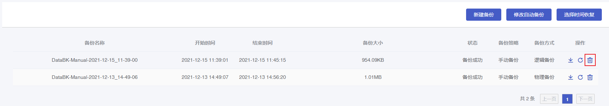
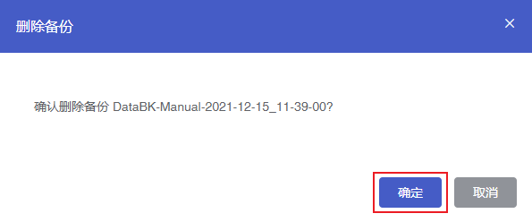

#### 操作场景

您可以删除手动备份的数据库备份，具体操作如下。

#### 操作步骤

1. 进入 [云数据库 MongoDB 控制台](https://console.capitalonline.net/mongodb)，点击数据库服务列表页操作 **详情** 按钮进入实例管理页面，点击 **备份** 查看备份列表。

2. 在备份页面选择需要删除的备份文件，点击 **删除** 按钮。

   

3. 在弹出的确认窗口中，点击 **确定** 即可删除备份文件。

   
   
   > **注意**：
   >
   > 删除后的备份文件无法恢复，如需保留请先将备份下载至本地。
