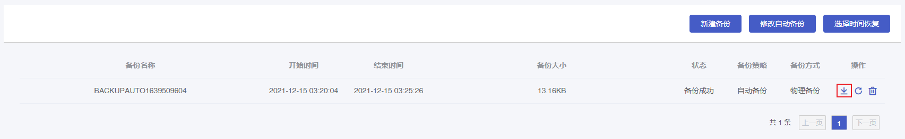
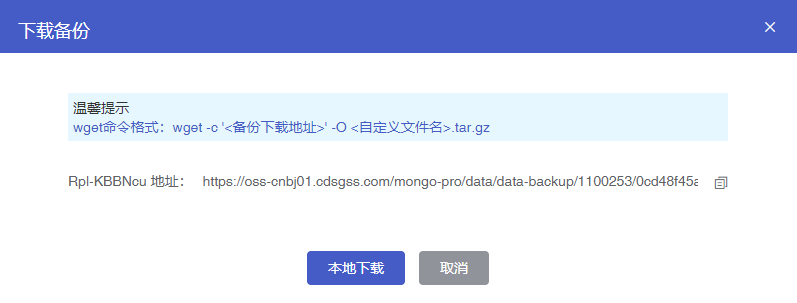

### 下载备份恢复至自建数据库

#### 操作场景

您可以下载物理备份或逻辑备份用于恢复到自建数据库中，本文将介绍详细的操作步骤。

> **注意**：
>
> + 物理备份不支持恢复到分片集。
> + 您的自建数据库版本应与云数据库 MongoDB 版本一致。 

#### 下载备份

##### 操作步骤

1. 进入 [云数据库 MongoDB 控制台](https://console.capitalonline.net/mongodb)，点击数据库服务列表页操作 **详情** 按钮进入实例管理页面，点击 **备份** 查看备份列表。

2. 在备份页面选择需要的物理备份文件，点击 **下载** 按钮。

   

3. 在备份下载窗口，点击 **Linux转义地址** 后的复制按钮复制下载链接。或点击 **本地下载** 下载至本地。

   

   > **提示**：
   >
   > 可用 `wget` 命令下载，wget 命令格式：
   >
   > ```
   >wget -c '<备份下载地址>' -O <自定义文件名>.tar.gz
   > ```

#### 物理备份恢复至自建数据库

物理备份默认带有原实例的配置，因此需移除原有配置，否则可能导致数据无法访问。

##### 操作步骤

1. 下载物理备份，详情参见 [下载备份](#下载备份)。

2. 使用 `tar` 命令解压下载的备份文件。

   ```
   tar xzvf <自定义文件名>.tar.gz
   ```

3. 进入解压后的 `physicsbackup/` 目录，将数据拷贝至自建数据库的数据目录（需保证该目录为空），示例中数据库数据目录路径为 `mongodb/mongodata/data/`。

   ```
   cp -r * /mongodb/mongodata/data/
   ```

4. 重启 mongod 并校验数据。

   ```
   ./mongod --dbpath /mongodb/mongodata/data/ --port 27017 --logpath /mongodb/mongodata/log/mongod.log --fork
   ```

5. 将数据恢复至单节点自建数据库，然后以副本集方式重启该节点。重启命令示例如下：

   ```
   ./mongod --replSet rs --dbpath /mongodb/mongodata/data/ --port 27017 --logpath /mongodb/mongodata/log/mongod.log --fork
   ```

6. 登录该节点清除原实例的副本集配置，命令如下：

   ```
   rs.slaveOk()
   use local
   db.system.replset.remove({})
   ```

7. 重启该节点，将新节点加入副本集进行初始化并校验数据（加入副本集的节点需已启动且无数据）。命令示例如下：

   ```
   rs.initiate({
   	_id:"rs",
   	members:[
   	{_id:0,host:"127.0.0.1:27017",priority:2},
   	{_id:1,host:"127.0.0.2:27017",priority:1},
   	{_id:2,host:"127.0.0.3:27017",priority:0,hidden:true}
   	]
   })
   ```

   > **说明**：rs.initiate() 命令用法，详情参见 [官网文档](https://docs.mongodb.com/manual/reference/method/rs.initiate/)。

#### 逻辑备份恢复至自建数据库

##### 操作步骤

1. 下载逻辑备份，详情参见 [下载备份](#下载备份)。

2. 使用 `tar` 命令解压下载的备份文件。

   ```
   tar xzvf <自定义文件名>.tar.gz
   ```

3. 使用 `mongorestore` 命令恢复数据，执行如下命令将备份文件中的数据恢复至自建数据库中。

   ```
   mongorestore -u username -p password --authenticationDatabase admin --drop ./snapshot/
   ```

   > **说明**：
   >
   > + -u：自建数据库账号名称
   > + -p：自建数据库账号密码
   > + ./snapshot/：逻辑备份解压后的 snapshot 目录路径
