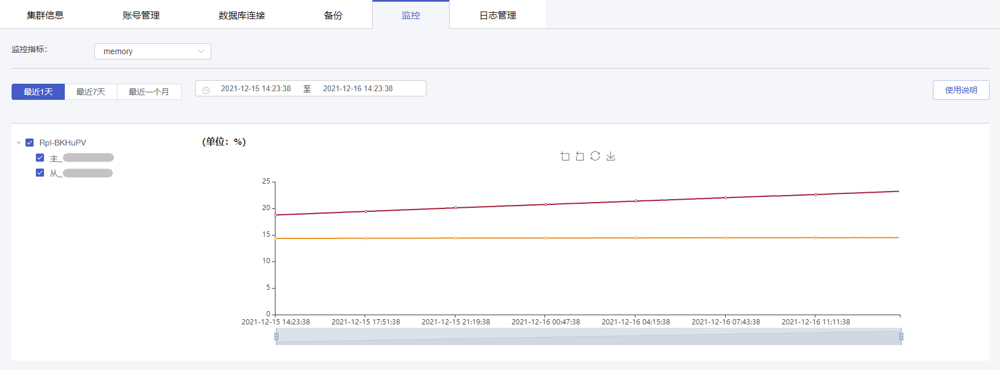

#### 前置条件

您已创建云数据库 MongoDB 实例，且实例正在运行。您可以通过 [云数据库 MongoDB 控制台](https://console.capitalonline.net/mongodb) 查看可视化监控指标，以掌握实例的运行信息。

> **注意**：
>
> 目前云数据库 MongoDB 最长支持查看 **90天** 前的监控数据。

#### 操作步骤

1. 进入 [云数据库 MongoDB 控制台](https://console.capitalonline.net/mongodb)，点击数据库服务列表页操作 **详情** 按钮进入实例管理页面，点击 **监控** 查看实例监控信息。

2. 在监控页面，查看云数据库 MongoDB 监控。

   

3. 更多云数据库 MongoDB 监控指标介绍，详情参见 [监控指标说明](./01.监控指标说明.md)。
