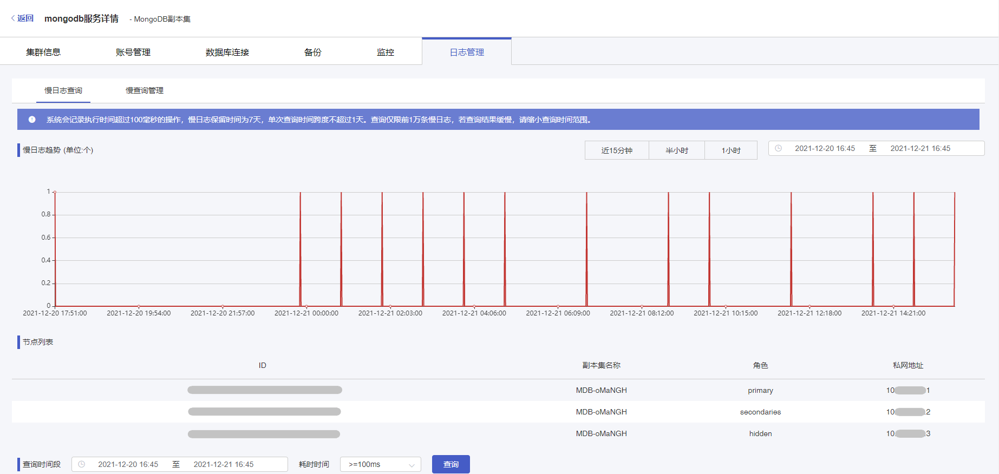

#### 前置条件

您已创建云数据库 MongoDB 实例，且实例正在运行。您可以通过 [云数据库 MongoDB 控制台](https://console.capitalonline.net/mongodb) 查看数据库运行过程中产生的慢日志，通过分析慢日志以优化数据库性能。

> **说明**：
>
> 系统会记录执行时间超过 100 毫秒的操作，慢日志保留时间为 7 天，单次查询时间跨度不超过 1 天。查询仅限前 1 万条慢日志，若查询结果缓慢，请缩小查询时间范围。

#### 操作步骤

1. 进入 [云数据库 MongoDB 控制台](https://console.capitalonline.net/mongodb)，点击数据库服务列表页操作 **详情** 按钮进入实例管理页面，点击 **日志管理** 查看实例慢日志信息。

2. 在慢日志查询页面，查看云数据库 MongoDB 慢日志趋势与详情。

   

3. 慢日志详情支持通过时间段与耗时时间来过滤查询结果。

   
