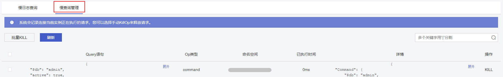
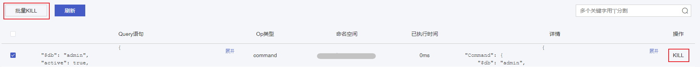
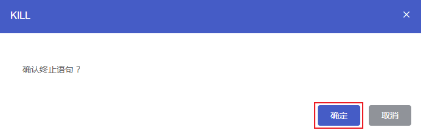

#### 前置条件

您已创建云数据库 MongoDB 实例，且实例正在运行。您可以通过 [云数据库 MongoDB 控制台](https://console.capitalonline.net/mongodb) 查看数据库当前正在执行的请求，并选择手动 KILL 来释放请求。

#### 操作步骤

1. 进入 [云数据库 MongoDB 控制台](https://console.capitalonline.net/mongodb)，点击数据库服务列表页操作 **详情** 按钮进入实例管理页面，点击 **日志管理** 查看实例慢日志信息。

2. 点击 **慢查询管理**，查看云数据库 MongoDB 当前正在执行的请求。

   

3. 您可以直接点击任意语句后操作中 **KILL** 按钮，或选择多个语句后点击左上角 **批量 KILL** 按钮来对语句进行 KILL 操作。

   

4. 点击 KILL 确认窗口中的 **确定**，即可清理慢日志请求语句。

   
