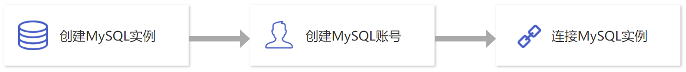

### 新手引导

如果您是初次使用云数据库 MySQL ，请根据新手引导学习，帮助您快速上手云数据库 MySQL。

#### 1.云数据库 MySQL 的基础知识

- [云数据库 MySQL 是如何运作的？](./02.产品简介/00.产品概述.md)
- [我为什么要选择云数据库 MySQL ？](./02.产品简介/01.产品优势.md)
- [云数据库 MySQL 典型应用场景](./02.产品简介/02.应用场景.md)
- [我在使用云数据库 MySQL 时有哪些限制？](./04.操作指南/00.使用限制.md)

#### 2.云数据库 MySQL 的计费模式

云数据库 MySQL 目前为按需计费模式，如果您想了解详细计费规则，详情参见 [计费概述](./03.购买指南/00.计费概述.md)。

#### 3.云数据库 MySQL 入门操作

#####    3.1 创建云数据库 MySQL 实例

如需创建云数据库 MySQL 实例，您需要先注册首云账号并购买云数据库 MySQL 服务。详情参见 [创建实例](./04.操作指南/02.管理实例/00.创建实例.md)。

#####    3.2 创建 MySQL 用户账号

在您创建成功云数据库 MySQL 实例后，您需要创建 MySQL 用户账号并配置账号权限。详情参见 [创建账号](./04.操作指南/04.账号管理/00.创建账号.md)。

#####    3.3 连接 MySQL 实例

创建完 MySQL 账号后，您可以通过内网方式访问您创建好的 MySQL 实例。详情参见 [连接实例](./04.操作指南/02.管理实例/01.连接实例.md)。

#### 4.控制台功能概述

- [设置维护时间](./04.操作指南/02.管理实例/04.设置维护时间.md)
- [调整配置](./04.操作指南/02.管理实例/02.调整配置.md)
- [修改实例字符集](./04.操作指南/02.管理实例/05.修改实例字符集.md)
- [销毁实例](./04.操作指南/02.管理实例/03.销毁实例.md)
- [数据库账号管理](./04.操作指南/04.账号管理/00.创建账号.md)
- [连接数据库](./04.操作指南/05.数据库管理/00.登录phpMyAdmin.md)
- [创建只读实例](./04.操作指南/03.只读实例.md)
- [设置实例参数](./04.操作指南/06.参数配置.md)
- [数据备份恢复](./04.操作指南/07.备份恢复/00.备份数据库.md)
- [监控报警](./04.操作指南/08.监控报警/00.监控功能.md)
- [标签管理](./04.操作指南/09.标签管理/00.标签概述.md)

#### 5.新手常见问题

- [创建云数据库 MySQL 需要多长时间？](./09.常见问题/08.控制台相关.md#创建云数据库 MySQL 需要多长时间？)
- [如何查看内网地址？](./09.常见问题/03.连接登录.md#如何查看内网地址？)
- [使用云数据库 MySQL 的注意事项？](./09.常见问题/07.功能特性.md#使用云数据库 MySQL 的注意事项？)
- [云数据库 MySQL 用户账号忘记密码怎么办？](./09.常见问题/08.控制台相关.md#云数据库 MySQL 用户账号忘记密码怎么办？)
- [我错误购买了实例，如何退款？](./09.常见问题/00.计费相关.md#我错误购买了实例，如何退款？)

#### 6.反馈与建议

在您使用云数据库 MySQL 期间如果有任何问题或意见，您可以通过在线工单或拨打客服电话进行反馈，我们将在第一时间为您解决问题。

+ 7x24小时服务热线：400-810-5300
+ 5x8小时售前服务热线：400-810-7006
