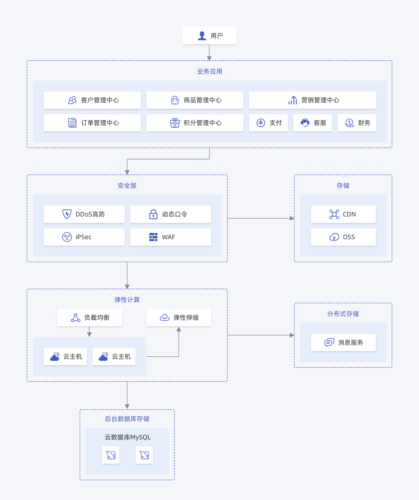
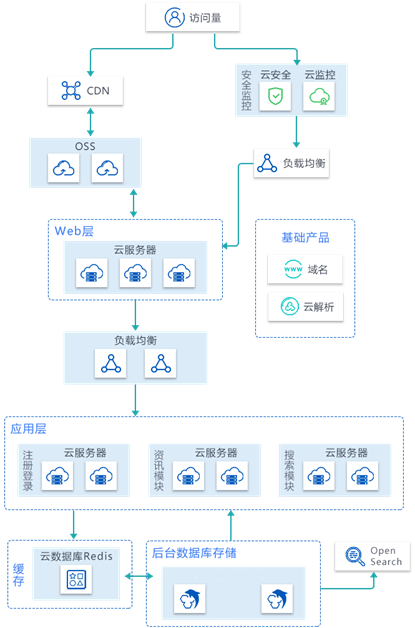
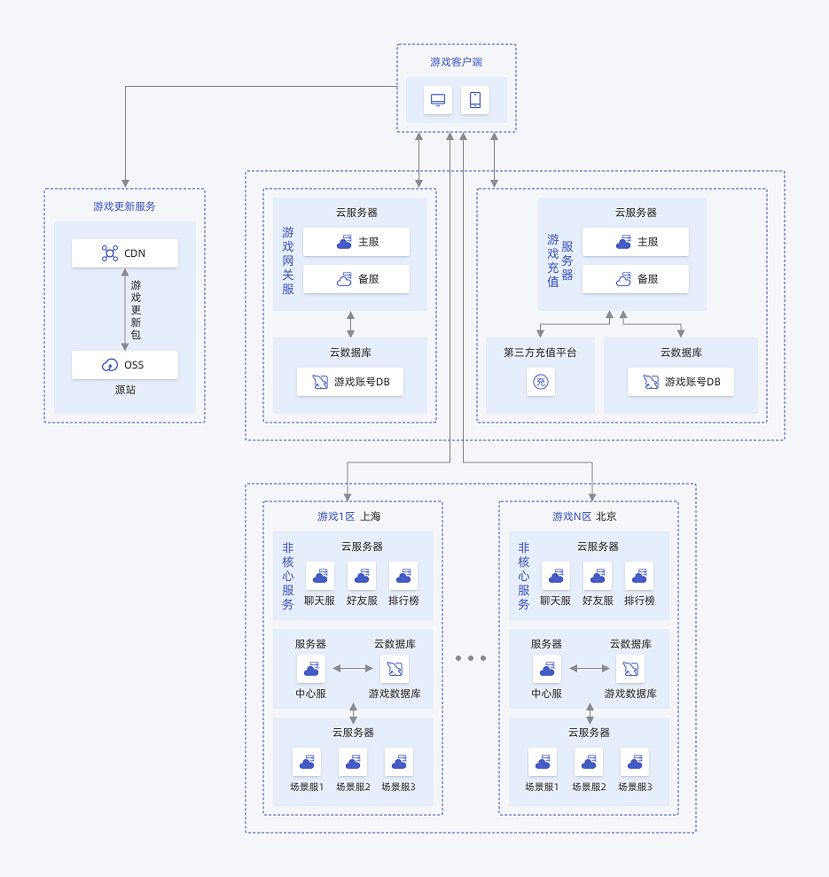

## 电商 高并发高性能场景

**提供灵活、高性能、安全可靠的数据库服务**

MySQL 高可用版提供了灵活、安全、高度可扩展且低成本的数据库解决方案，让您专注于打造高品质客户体验，无需为管理底层数据库而操心。

## WEB 高可靠性场景

**只读实例扩展，显著提高数据库的读负载能力**

MySQL 高可用版具有高吞吐量、大规模存储可扩展性和高可用性，利用 MySQL 只读实例，分担主实例的读写压力，满足 WEB 类的业务需求。

## 游戏 高可用场景

**高稳定性，随时回档到任意时间点**

- 对计算资源的弹性伸缩能力，赋予您更高的生产力，分钟级部署游戏分区数据库
- 搭配高安全链路，实现全自动无感知容灾切换，业务稳定性先人一步
- 支持任意时间点回档，帮助您轻松回档

