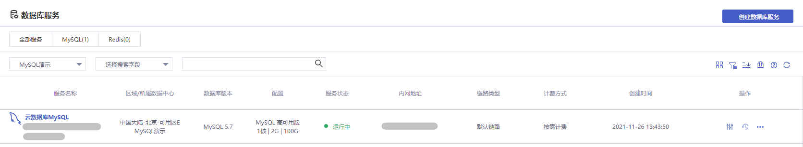

本文主要介绍云数据库 MySQL 的控制台操作，通过对实例列表与实例管理页的功能操作讲解，帮助您轻松管理云数据库 MySQL。

## 实例列表页

您可以在数据库服务列表页创建 MySQL 实例，或对创建好的 MySQL 实例进行管理。

## 实例管理页

您可以通过点击数据库服务列表页中 MySQL 实例的名称进入实例管理页，或点击列表右侧操作按钮进入到实例管理页对实例进行查看、监控、管理操作。

| 功能       | 说明                                                         |
| ---------- | ------------------------------------------------------------ |
| 基本信息   | 在基本信息页面，您可以看到 MySQL 实例的各种信息，点击 **修改** 按钮即可编辑实例基本信息。 |
| 用户权限   | 在用户权限页面，您可以创建或删除 MySQL 实例的用户，并对创建的用户进行修改密码、重置账号权限等操作，详情参见 [账号管理](./../04.操作指南/04.账号管理/00.创建账号.md)。 |
| 监控功能   | 在监控功能页面，您可以查看当前实例资源使用情况、引擎监控、部署监控等各维度的核心指标，详情参见 [监控功能](./../04.操作指南/08.监控报警/00.监控功能.md) 和 [报警功能](./../04.操作指南/08.监控报警/02.报警功能.md)。 |
| 备份恢复   | 在备份恢复页面，您可以配置自动备份规则或进行手动备份与数据恢复操作，详情参见 [备份数据库](./../04.操作指南/07.备份恢复/00.备份数据库.md)。 |
| 只读实例   | 在只读实例页面，您可以创建一个或多个（最多不超过3个）只读实例，用于支持读写分离等场景，能够极大提升数据库读负载压力，详情参见 [只读实例](./../04.操作指南/03.只读实例.md)。 |
| 参数配置   | 在参数配置页面，您可以对 MySQL 的众多参数进行配置，并支持查看修改历史，点击运行参数值下的  可对参数进行修改，详情参见 [参数配置](./../04.操作指南/06.参数配置.md)。 |
| 编辑标签   | 在编辑标签弹窗，您可以对当前实例的标签进行编辑，可以选择将左侧已有候选标签或输入标签内容再点击 **添加新标签** 添加至候选标签列表，详情参照 [编辑标签](./../04.操作指南/09.标签管理/01.编辑标签.md)。 |
| 删除标签   | 在删除标签弹窗，您可以删除当前实例下所有标签，点击 **确认按钮** 即可删除。 |
| 连接数据库 | 在连接数据库弹窗中输入 MySQL 用户名及密码，点击 **确认** 即可进入 phpMyAdmin 操作您的数据库。 |
| 终止实例   | 在终止实例弹窗，您可以阅读终止实例规则并勾选“已阅读并同意销毁规则”，在点击 **确定** 后，您的实例将会被终止。 |
