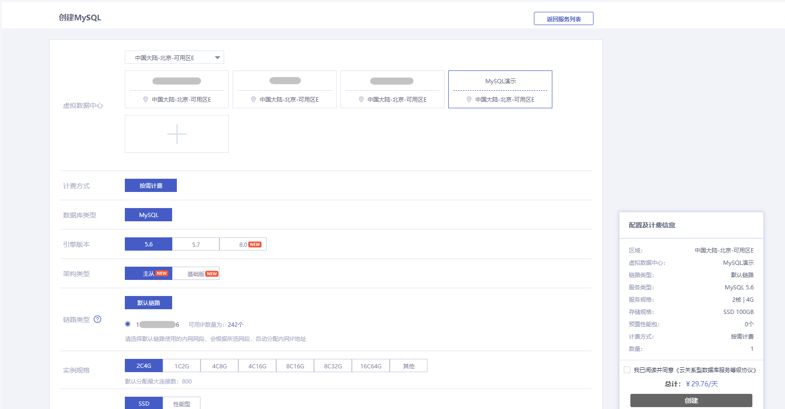

### 创建实例

#### 前置条件

您已注册首云账号，并已完成身份验证。

#### 控制台创建

##### 操作步骤

1. 进入 [云数据库 MySQL 控制台](https://console.capitalonline.net/loadbalancers)，点击右上角 **创建数据库服务**。

   

2. 点击数据库服务 MySQL 的 **开通服务** 进入到数据库服务创建页面。

   

3. 根据业务需求选择各配置项，请检查无误后阅读并勾选《云关系型数据库服务等级协议》，点击 **创建**。

   

   + **虚拟数据中心**：根据您的业务需要部署 MySQL 的地域，虚拟数据中心购买后不能更换。请根据目标用户所在的地理位置就近选择地域，提升用户访问速度。请确保云数据库 MySQL 实例与需要连接的 ECS 实例创建于同一个地域，否则它们无法通过内网互通，只能通过外网互通，无法发挥最佳性能。
   + **计费方式**：当前云数据库 MySQL 仅支持创建按需计费实例。
   + **数据库类型**：当前云数据库 MySQL 仅支持创建 MySQL 实例。
   + **引擎版本**：当前云数据库 MySQL 支持的引擎版本为5.6、5.7、8.0。
   + **架构类型**：当前云数据库 MySQL 的架构支持主从版（双节点）与基础版（单节点）类型。
   + **链路类型**：云数据库 MySQL 的私网网段。
   + **实例规格**：云数据库 MySQL 实例的规格，最大连接数与实例规格相关，详情参见 [计费概述](.\..\..\03.购买指南\00.计费概述.md)。
   + **存储**：默认大小为 100GB，购买步长为 100GB，单块盘最大容量为 2000GB。
     + SSD 盘：默认 5000 IOPS，支持扩展到最高 10000 IOPS。具备稳定的高随机读写性能、高可靠性。适用于大型数据库等超频繁访问或超高I/O应用场景。
     + 性能型盘：默认 3000 IOPS。具备高性价比，中等随机读写性能、高可靠性。适用于中小型数据库、日志等频繁访问或高I/O应用场景。
     + 预置性能包：仅支持 SSD 盘选择，每份可扩展 100IOPS 及 3.2MBps 吞吐量，最多支持购买 50 份。
   + **白名单**：云数据库 MySQL 默认支持白名单功能，仅允许在白名单内的 IP 访问 云数据库 MySQL。
   + **时区**：云数据库 MySQL 支持修改时区，默认为 UTC / + 08:00。
   + **实例名称**：云数据库 MySQL 实例的名称，支持创建后设置与立即命名。如果选择创建后设置将生成一个默认名称。
   + **数量**：云数据库 MySQL 支持批量创建，数量默认为 1，最多支持一次创建 10 个云数据库 MySQL 实例。

4. 创建成功后页面会跳转至实例列表页，可以看到刚才创建的实例显示为“创建中”，耐心等待3~5分钟，实例状态变为“运行中”时，即可创建用户账户。

   

#### API创建

通过 API 购买云数据库 MySQL，详情参见 [创建云数据库MySQL实例](.\..\..\08.API文档\02.实例相关接口\02.创建云数据库MySQL实例.md)。

#### 后续操作

在 MySQL 实例用户管理处创建用户，详情参见 [创建账号](.\..\04.账号管理\00.创建账号.md)。
