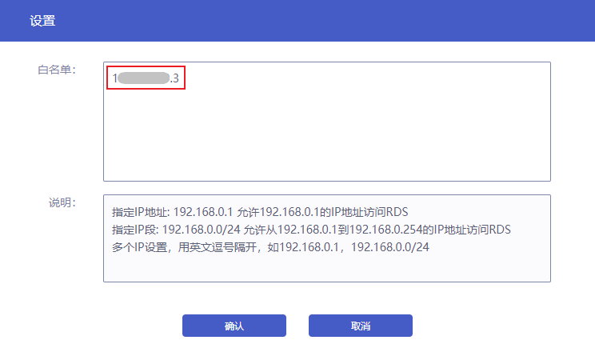
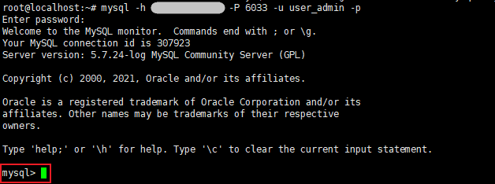

## 前置条件

您已成功创建用户账号，且用户账号状态为“已激活”。创建 MySQL 用户，详情参见 [创建用户账号](./../04.账号管理/00.创建账号.md)。

## Linux 云服务器连接

### 操作步骤

1. 进入 [云数据库 MySQL 控制台](https://console.capitalonline.net/dbinstances)，点击实例的名称进入到实例管理页面，在 **规格配置** 模块中，开启 **白名单**。
 
   > **注意**：
   >
   > 如不开启白名单，则同一私网网段下所有 IP 均可以访问云数据库 MySQL。

   

2. 在白名单中，配置与云数据库 MySQL 同一虚拟数据中心下，且在同一私网网段的云服务器 IP，支持 IP 地址与 IP 网段，添加后点击 **确认**。

   

3. 白名单添加后实例将进入 **配置变更中** 状态，待实例恢复至 **运行中** 状态后，即可通过云服务器连接 MySQL。

4. 登录云服务器，在您的云服务器中下载 MySQL 客户端。以 Ubuntu 20.04 系统为例，执行以下命令安装 MySQL 客户端。

   ```
   apt install mysql-client
   ```

5. 安装成功后，执行以下命令连接云数据库 MySQL 实例。

   ```
   mysql -h hostname -P port -u username -p
   ```

   #### 参数说明

   + -h：云数据库 MySQL 的连接地址，在 [云数据库 MySQL 控制台](https://console.capitalonline.net/dbinstances) 可查看云数据库 MySQL 的内网地址。
   + -P：云数据库 MySQL 的端口号，默认为 6033。
   + -u：云数据库 MySQL 的账号名称，创建 MySQL 用户，详情参见 [创建用户账号](./../04.账号管理/00.创建账号.md)。
   + -p：云数据库 MySQL 的账号密码，修改 MySQL 账号密码，详情参见 [修改密码](./../04.账号管理/01.修改密码.md)。

6. 当提示 `mysql>` 时，即说明已成功连接云数据库 MySQL。

   

## 控制台 phpMyAdmin 连接

### 操作步骤

1. 进入 [云数据库 MySQL 控制台](https://console.capitalonline.net/dbinstances)，点击实例实例的名称进入到实例管理页面，点击 **更多** > **连接数据库**。

   

2. 在弹窗中输入您之前创建好的 MySQL 用户名及密码，确认无误后，点击 **确认** 即可连接您的数据库。

   

3. 更多 phpMyAdmin 操作，详情参见 [数据库管理](./../05.数据库管理/00.登录phpMyAdmin.md)。
