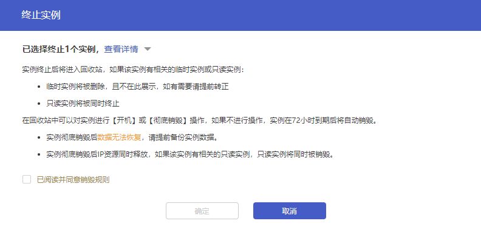

### 销毁实例

#### 操作场景

根据您的业务需求，您可以在 [云数据库 MySQL 控制台](https://console.capitalonline.net/loadbalancers) 终止实例。

- 按量计费实例退还后，实例被移入回收站保留 72 小时，期间实例无法访问。如您想恢复该实例，可在回收站进行续费恢复。

终止实例后，实例的状态一旦变为 **已隔离** 时，将不再产生与该实例相关的费用。

> **注意**：
>
> - 实例彻底销毁后数据无法恢复，请提前备份实例数据以防数据丢失。
> - 实例终止后将进入回收站，如果该实例有相关的临时实例或只读实例：
>   - 临时实例将被删除，且不在此展示，如有需要请提前转正
>   - 只读实例将被同时终止
> - 在回收站中可以对实例进行 **开机** 或 **彻底销毁** 操作，如果不进行操作，实例在 72 小时到期后将自动销毁。
>   - 实例彻底销毁后数据无法恢复，请提前备份实例数据。
>   - 实例彻底销毁后 IP 资源同时释放，如果该实例有相关的只读实例，只读实例将同时被销毁。
>

#### 控制台删除

##### 操作步骤

1. 进入 [云数据库 MySQL 控制台](https://console.capitalonline.net/loadbalancers)，在实例列表中选择要终止的实例，在操作列选择 **更多** > **终止实例**，或进入到实例管理页面选择 **更多** > **终止实例**。

2. 在弹出的窗口中，阅读并勾选“已阅读并同意销毁规则”后，单击 **确定** 。

   

#### API删除

通过 API 删除云数据库 MySQL 实例，详情参见 [删除云数据库MySQL实例](./../../08.API文档/02.实例相关接口/06.删除云数据库MySQL实例.md)。
