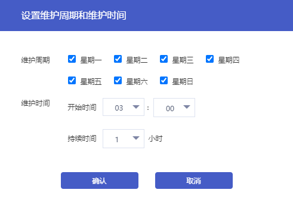

## 操作场景

为了保证您的数据库安全稳定性、释放项目运维人员的夜间工作压力，首云控制台提供了**维护时间**功能, 通过设置它可在指定时长内对您的实例进行维护，建议您将维护时间选择在业务低峰期，确保维护对您的实例影响最小。

此外，建议实例调整配置及数据迁移等操作也在维护时间内操作。

以数据库实例调整规格为例，实例规格升级若涉及到数据搬迁，那么在升级完成时会发生秒级数据库连接闪断。在调整配置时选择执行时间为 **可维护时间内** ，配置变更任务将会在下一个维护时间内发起。需要注意的是，选择执行时间为 **可维护时间内** 时，可能会延长整个实例配置变更所需时间。

> **注意**：
>
> 实例切换时会发生秒级数据库连接闪断，请确保业务具备重连机制

## 设置维护时间

### 操作步骤

1. 进入 [云数据库 MySQL 控制台](https://console.capitalonline.net/dbinstances)，点击实例的名称进入到实例管理页面。

2. 在基本信息的维护信息模块中，点击 **修改**。

   

3. 在弹窗中，配置您希望的维护周期与维护时间，点击 **确认**。

   

## 提前执行任务

当任务选择在维护时间执行时，因特殊情况需要立即执行或取消，可在 **查看维护时间任务** 处进行编辑或删除任务。

### 操作步骤

1. 进入 [云数据库 MySQL 控制台](https://console.capitalonline.net/dbinstances)，点击实例的名称进入到实例管理页面。

2. 在基本信息的维护信息模块中，点击 **查看维护时间任务**。

   

3. 在弹窗中，选择您希望修改维护时间的任务，点击 **编辑**。

   

4. 在调整配置页中，重新选择执行时间为 **立即执行**。

   
