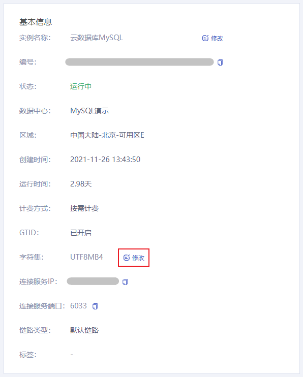

本文将介绍如何通过控制台修改实例的字符集。

> **注意**：
>
> 实例的默认字符集为  UTF8MB4，修改字符集会重启实例，重启期间不能对该实例进行操作。
>

## 操作步骤

1. 进入 [云数据库 MySQL 控制台](https://console.capitalonline.net/dbinstances)，点击实例的名称进入到实例管理页面。

2. 在基本信息中找到字符集，点击后方 **修改** 按钮。

   

3. 选择需要的字符集后，点击 **确认** 即可。

   
