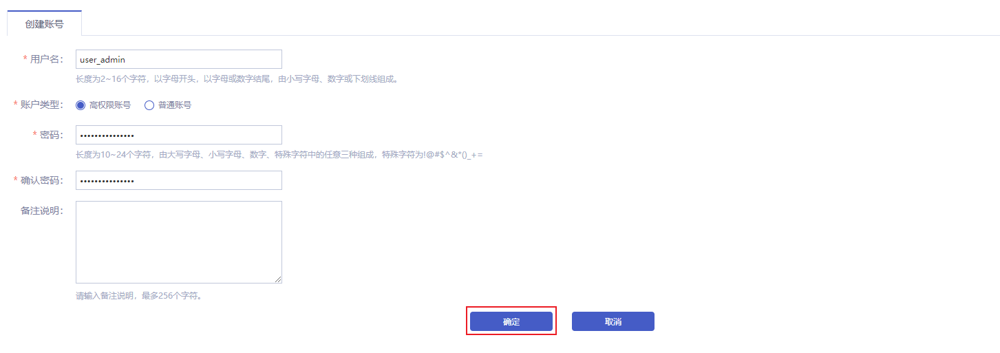
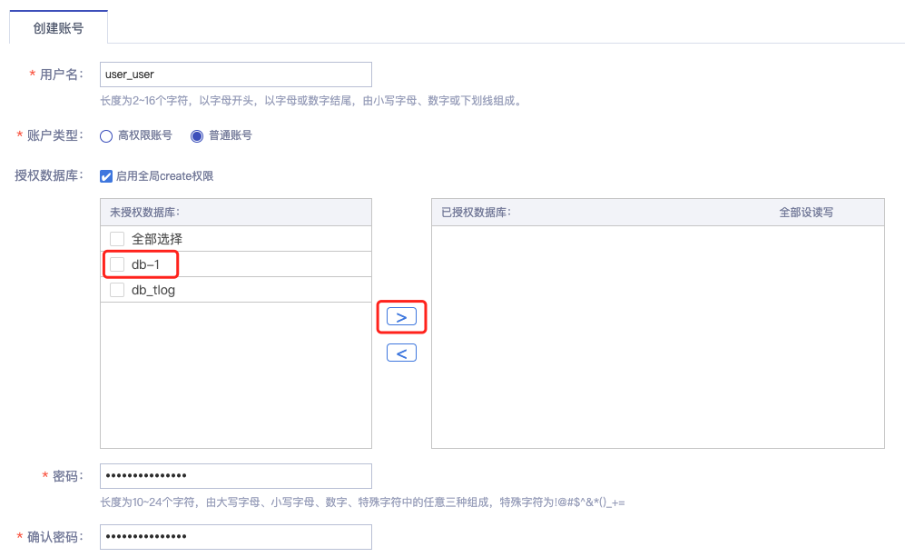
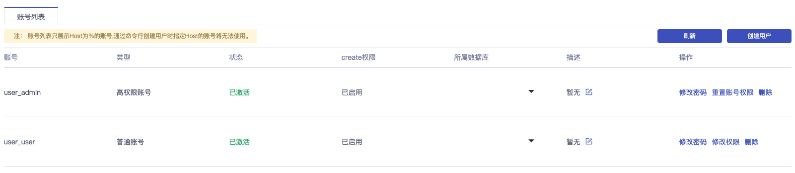

### 创建账号

#### 操作场景

在您新创建完一个云数据库 MySQL 实例后，您需要创建一个或多个 MySQL 用户账号，用于访问您的 MySQL 数据库。

#### 前置条件

您已成功创建 MySQL 实例，实例状态为运行中。创建实例步骤详情参见 [创建实例](./../../04.操作指南/02.管理实例/00.创建实例.md)。

#### 控制台创建

##### 操作步骤

1. 进入 [云数据库 MySQL 控制台](https://console.capitalonline.net/dbinstances)，点击实例的名称进入到实例管理页面，点击 **用户权限** 查看账号列表，或从更多操作中选择 **用户权限** 进入。

2. 点击 **创建用户** 按钮，进入创建账号页面。

   

3. 根据页面提示填写以下所有信息。

   <table width="95%" border="1" cellpadding="2" cellspacing="1">
   	<thead>
           <tr>
               <th align="left" width="10%">配置项</th>
               <th align="left" width="80%">说明</th>
           </tr>
   	</thead>
       <tbody>
           <tr>
               <td>用户名</td>
               <td>MySQL 实例的用户名。 
           	长度为2~16个字符，以字母开头，以字母或数字结尾，由小写字母、数字或下划线组成。</td>
           </tr>
   		<tr>
               <td>账户类型</td>
               <td>账号类型分为高权限账号和普通权限账号。
                   <ul>
                       <li><b>高权限账号</b>：
                       	<ol>
                               <li>只能通过控制台创建和管理。</li>
                               <li>一个实例中只能创建一个高权限账号，可以管理所有普通账号和数据库。</li>
                               <li>开放了更多权限，可满足个性化和精细化的权限管理需求，比如可按用户分配不同表的查询权限。</li>
                               <li>拥有实例下所有数据库的所有权限。</li>
                               <li>可以断开任意账号的连接。</li>
                           </ol>
                       </li>
                       <li><b>普通权限账号</b>：
                       	<ol>
                               <li>可以通过控制台或者 SQL 语句创建和管理。</li>
                               <li>一个实例可以创建多个普通账号，具体的数量与实例内核有关。</li>
                               <li>需要手动给普通账号授予特定数据库的权限。</li>
                               <li>普通账号不能创建和管理其他账号，也不能断开其他账号的连接。</li>
                           </ol>
                       </li>
                   </ul>
               </td>
           </tr>
   		<tr>
               <td>授权数据库 (低权限账号)</td>
   			<td>当您创建的账号为普通账号时，需要为该账号授予一个或多个数据库的权限。本参数可以留空，在创建账号后再给账号授权。详情参见 <a herf="./../../02.产品简介/05.产品实例/01.数据库账号权限.md">数据库例账号</a>。
   				<ol>
                       <li>从左侧选中一个或多个数据库，单击添加按钮，添加到右侧。</li>
                       <li>在右侧框中，为某个数据库选择读写、只读、仅DDL或只DML。</li>
                       <li>如果要为多个数据库批量设置相同的权限，则单击右侧框里右上角的按钮，如全部设读写。</li>
                   </ol>
                   <b>说明</b>：右上角的按钮会随着点击而变化，例如，单击 <b>全部设读写</b> 后，该按钮会变成 <b>全部设只读</b>。
   			</td>
   		</tr>
   		<tr>
   			<td>密码</td>
               <td>MySQL 实例的账号密码 长度为10~24个字符，由大写字母、小写字母、数字、特殊字符中的任意三种组成，特殊字符为!@#$^&*()_+=</td>
   		</tr>
   		<tr>
   			<td>确认密码</td>
               <td>二次确认密码，确保两次密码相同即可。</td>
   		</tr>
   		<tr>
   			<td>备注说明</td>
               <td>对该账号进行备注说明，最多256个字符。</td>
   		</tr>
   	</tbody>
   </table>

   + 若选择的为高权限账号，点击 **确定** 即可创建 MySQL 高权限账号。

     

   + 若选择的为普通权限账号，则需要配置”授权数据库“，用于限制普通账号可访问的数据库及操作权限，配置完成后点击 **确定** 即可创建 MySQL 普通账号。

     

4. 创建成功后，账号列表将显示您刚才创建的用户账号为 **已激活** 状态。现在您可以通过创建好的用户账号访问您的 MySQL 数据库。

   

#### API创建

通过 API 创建 MySQL 用户，详情参见 [创建云数据库MySQL高权限账号](./../../08.API文档/03.账号相关接口/00.创建云数据库MySQL高权限账号.md)。

#### 后续操作

在 MySQL 实例详情页面中，通过 Web 方式访问数据库，详情参见 [连接实例](./../../04.操作指南/02.管理实例/01.连接实例.md)。
