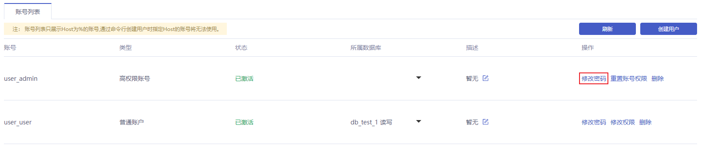
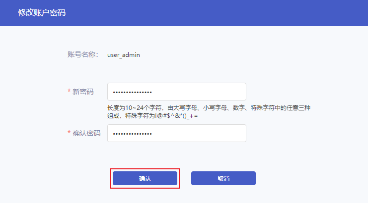

## 操作背景

在使用云数据库 MySQL 过程中，如果您忘记数据库账号密码，可以通过控制台重新设置密码。

## 操作步骤

1. 进入 [云数据库 MySQL 控制台](https://console.capitalonline.net/dbinstances)，点击实例的名称进入到实例管理页面，点击 **用户权限** 查看账号列表，或从更多操作中选择 **用户权限** 进入。

2. 点击需要修改密码的账号后 **修改密码** 按钮，弹出修改账号密码窗口。

   

3. 按照提示规则输入新的密码，点击 **确认** 即可修改成功。

   

   > **说明**：
   >
   > 密码长度为 10~24 个字符。 由大写字母、小写字母、数字、特殊字符中的任意三种组成。 特殊字符为!@#$^&*()_+=。
