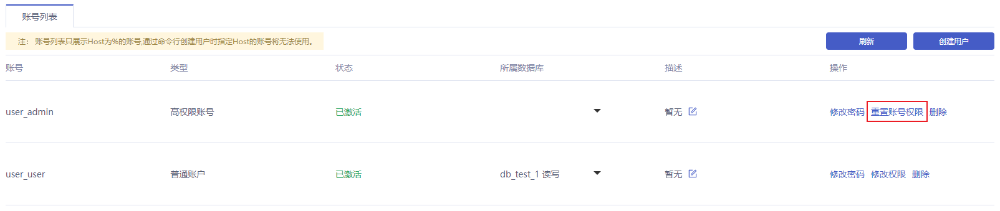
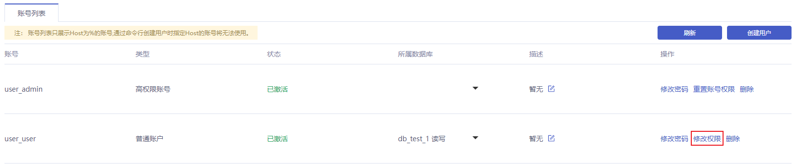
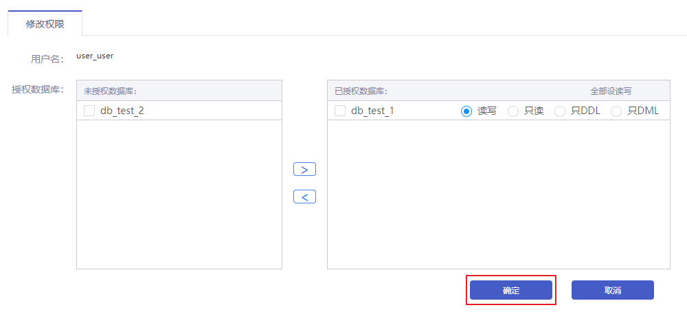

## 操作背景

- 您可以根据需要修改普通账号的权限
- 高权限账号的权限只能重置为初始状态，无法修改为指定的权限
- 如果高权限账号自身出现问题，比如权限被意外回收（REVOKE ），您可以通过重置账号权限的方法恢复

## 操作步骤

### 高权限账号

1. 进入 [云数据库 MySQL 控制台](https://console.capitalonline.net/dbinstances)，点击实例的名称进入到实例管理页面，点击 **用户权限** 查看账号列表，或从更多操作中选择 **用户权限** 进入。

2. 点击 **重置账号权限** 按钮，弹出重置账号权限窗口。

   

3. 点击确认窗口中的 **确定** ，即可重置高权限账号权限。

   

### 普通账号

1. 进入 [云数据库 MySQL 控制台](https://console.capitalonline.net/dbinstances)，点击实例的名称进入到实例管理页面，点击 **用户权限** 查看账号列表，或从更多操作中选择 **用户权限** 进入。

2. 点击 **修改权限** 按钮，进入修改权限页面。

   

3. 在修改权限页面修改普通账号权限，可以添加或移除数据库授权，并对已授权的数据库进行操作权限设置。修改成功后点击 **确定** 即可。

   

## 相关OpenAPI

通过 API 修改 MySQL 用户权限，详情参见 [修改云数据库MySQL普通账号权限](./../../08.API文档/03.账号相关接口/04.修改云数据库MySQL普通账号权限.md)。
