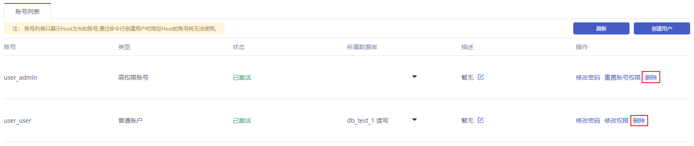

## 操作背景

若您需要对已创建的数据库帐号进行停用，可以通过 [云数据库 MySQL 控制台](https://console.capitalonline.net/dbinstances) 删除数据库帐号。

> **注意**：
>
> - 数据库帐号删除后不可恢复，请谨慎操作。
> - 为了避免因帐号误删除而影响业务的正常使用，请确认要删除的数据库帐号没有提供使用。

## 操作步骤

1. 进入 [云数据库 MySQL 控制台](https://console.capitalonline.net/dbinstances)，点击实例的名称进入到实例管理页面，点击 **用户权限** 查看账号列表，或从更多操作中选择 **用户权限** 进入。

2. 选择您要删除的账号，点击 **删除** 按钮，弹出删除账号窗口。

   

3. 点击 **确定** 按钮即可删除数据库账号。

   

