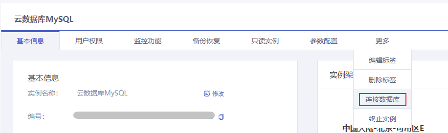
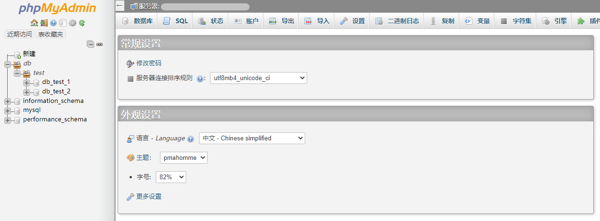

本文为您介绍如何通过云数据库 MySQL 控制台进入 phpMyAdmin 连接您的数据库。

## 操作步骤

1. 进入 [云数据库 MySQL 控制台](https://console.capitalonline.net/dbinstances)，点击实例实例的名称进入到实例管理页面，点击 **更多** > **连接数据库**。

   

2. 在弹窗中输入您之前创建好的 MySQL 用户名及密码，确认无误后，点击 **确认** 即可连接您的数据库。

   

3. 通过 phpMyAdmin 成功连接到 MySQL 数据库，在此页面您可以看到 MySQL 数据库的各种模式和对象，以及进行创建表、数据插入和查询等操作。

   

## 后续操作

在 phpMyAdmin 创建数据库与表，详情参见 [建立数据库和表](./01.建立数据库和表.md)。
