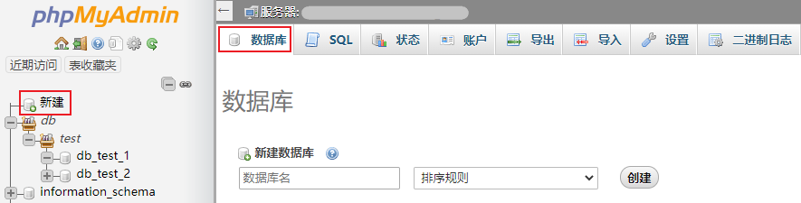
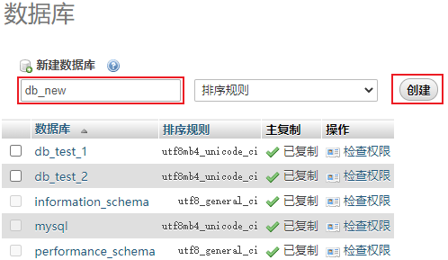
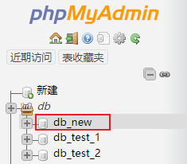
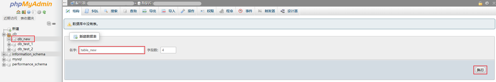

## 建立数据库和表

### 操作步骤

#### 创建数据库

1. 在 phpMyAdmin 中右侧菜单，点击 **新建** 或者在详情页上方点击 **数据库**，进入数据库创建页面。

   

2. 在新建数据库页面中，输入数据库名，点击 **创建** 即可创建数据库。

   

3. 创建成功后，右侧菜单将展示新创建的数据库。

   

#### 创建数据表

1. 选择需要建表的数据库，单击数据库名称进入该数据库管理页面，在新建数据表处输入表名与字段数，点击 **执行** 进入数据表创建页面。

   

2. 进入数据表创建页面后，若需要添加字段，请在 **添加** 处输入所需添加的字段数，然后单击 **执行**。

   + **结构**：为各字段结构信息。
   + **PARTITION definition**：为分区信息。

   

3. 填写完信息后单击 **保存**，即可创建数据表，创建成功后，右侧菜单将展示新创建的数据表。

   

### 后续操作

在 phpMyAdmin 删除数据库与表，详情参见 [删除数据库和表](./02.删除数据库和表.md)。
