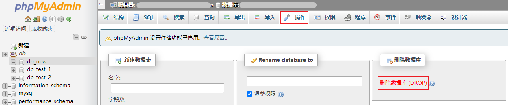
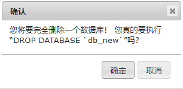
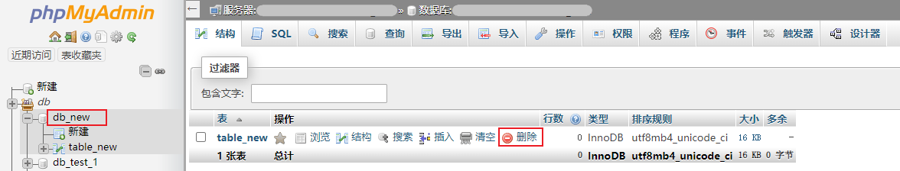
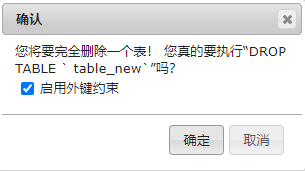

## 删除数据库和表

### 操作步骤

#### 删除数据库

1. 点击需要删除表的数据库名称，进入数据库管理页面，在上方操作中点击 **操作** 进入操作页面。在删除数据库模块，单击 **删除数据库（DROP）**。

   

2.  在弹出的窗口中，点击 **确定** 即可删除数据库。

   

#### 删除数据表

1. 点击需要删除表的数据库名称，进入数据库管理页面，在操作列中选择需要删除的表，点击 **删除**。

   

2. 在弹出的窗口中，点击 **确定** 即可删除数据表。

   

### 更多操作

在 phpMyAdmin 使用 SQL 语句，详情参见 [使用SQL命令](./03.使用SQL命令.md)。
