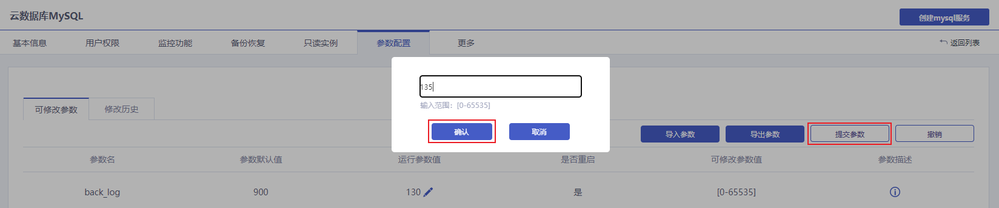
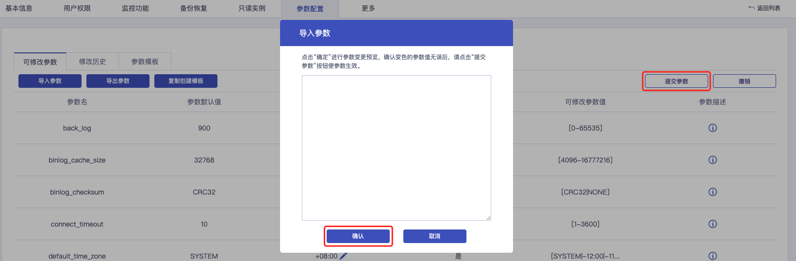

### 参数配置

您可以在控制台查看和修改部分参数的值，并在控制台查询参数修改记录。

> **注意**：
>
> - 修改参数值时请参考控制台上 **可修改参数** 页面中的 **参数名** 列。
> - 部分参数修改后需要重启实例，具体请参见控制台上可修改参数页面中的 **是否重启** 列。建议您在业务低峰期操作，并确保应用程序具有重连机制。
>

#### 修改参数值

##### 修改单个参数

1. 进入 [云数据库 MySQL 控制台](https://console.capitalonline.net/loadbalancers)，点击实例的名称进入到实例管理页面，点击 **参数配置** 查看可修改参数列表。

2. 在可修改参数列表内找到需要修改的参数，点击  按钮。

   

3. 根据提示的取值范围输入参数值，确认无误后点击 **确定**，再点击右上角的 **提交参数**。

   

   > **说明**：
   >
   > + 如果修改的参数需要重启实例才生效，系统会提示您是否重启，建议您在业务低峰期操作，并确保应用程序具有重连机制。
   > + 参数的修改未提交时，如果想取消修改，请单击 **撤销**。

##### 批量单个参数

1. 进入 [云数据库 MySQL 控制台](https://console.capitalonline.net/loadbalancers)，点击实例的名称进入到实例管理页面，点击 **参数配置** 查看可修改参数列表。

2. 单击 **导出参数**，会将 txt 格式的参数文件保存到本地，该 txt 文件包含该实例所有可修改的参数值。

   

3. 修改导出的参数文件，修改完成后，单击 **导入参数** ，将参数文件内容粘贴到对话框中。

   

4. 确认无误后点击 **确定** ，再点击右上角的 **提交参数**。

   

   > **说明**：
   >
   > + 修改的参数值背景会变为深色，您可以确定是否是这几个参数。
   >
   > - 当有不符合参数范围的值出现时，会用红色标出。
   >
   > - 如果修改的参数需要重启实例才生效，系统会提示您是否重启，建议您在业务低峰期操作，并确保应用程序具有重连机制。
   >
   > - 参数的修改未提交时，如果想取消修改，请单击 **撤销**。

#### 查看修改历史

1. 进入 [云数据库 MySQL 控制台](https://console.capitalonline.net/loadbalancers)，点击实例的名称进入到实例管理页面，点击 **参数配置** 查看可修改参数列表。

2. 单击 **修改历史**，切换到修改历史页面。

   

3. 在修改历史页面，您可以查看最近参数修改的记录。
