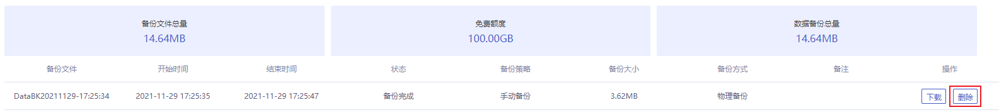

## 删除备份

您可以删除手动备份的数据库备份，具体操作如下。

### 控制台删除

#### 操作步骤

1. 进入 [云数据库 MySQL 控制台](https://console.capitalonline.net/dbinstances)，点击实例的名称进入到实例管理页面，点击 **备份恢复** 查看备份列表，或从更多操作中选择 **备份恢复** 进入。

2. 在备份恢复页面点击选择要删除的备份文件，点击 **删除**。

   

3. 在弹出的确认窗口中，点击【确定】即可删除备份文件。

   

   > **注意**：删除后的备份文件无法恢复，如需保留请先将备份下载至本地

### API删除

通过 API 删除 MySQL 备份，详情参见 [删除云数据库MySQL备份](./../../08.API文档/04.备份相关接口/02.删除云数据库MySQL备份.md)。
