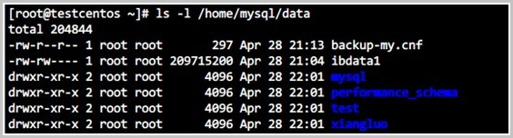
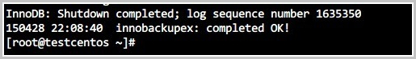
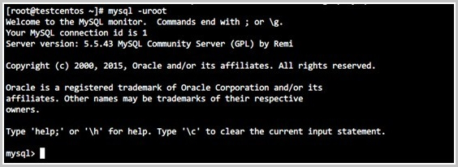

## 操作场景

开源软件 Percona Xtrabackup 可以用于对数据库进行备份恢复，您可以使用该软件将云数据库 MySQL 的备份文件恢复到自建数据库中，本文将介绍详细的操作步骤。

## 注意事项

- 本文使用 Linux 7 的操作系统为例进行演示。

- 操作系统中已安装数据恢复工具 Percona XtraBackup ，您可以从 Percona XtraBackup 官网下载安装。

- MySQL 5.6 及之前的版本需要安装 Percona XtraBackup 2.3，安装指导请参见官方文档 Percona XtraBackup 2.3 。

- MySQL 5.7 版本需要安装 Percona XtraBackup 2.4，安装指导请参见官方文档 Percona XtraBackup 2.4。

- MySQL 8.0 版本需要安装 Percona XtraBackup 8.0，安装指导请参见官方文档 Percona XtraBackup 8.0。

- 本地 MySQL 数据库安装在 64 位的 Linux 系统中，且与云数据库 MySQL 版的版本相同。

- 在 Linux 服务器上，安装解压工具 qpress。

  ```
  wget -d --user-agent="Mozilla/5.0 (Windows NT x.y; rv:10.0) Gecko/20100101 Firefox/10.0" http://www.quicklz.com/qpress-11-linux-x64.tar
  
  tar xvf qpress-11-linux-x64.tar
  
  cp qpress /usr/bin
  ```

  > **说明**：由于软件限制，目前只支持将云数据库 MySQL 的备份文件恢复到安装在 linux 系统中的自建 MySQL 数据库中。

## 操作步骤

1. 下载数据备份。

2. 执行如下命令，解压已下载的数据备份文件。

   > **说明**：本文以自定义路径 `/home/mysql/data` 为例，您可以根据实际情况将其替换成实际路径。

   目前物理备份集文件格式为：

   + MySQL 5.6、5.7 备份文件格式为 tar 压缩包 （.tar.gz 后缀）

   + MySQL 8.0 备份文件格式为 xb 文件（.xb后缀）

   对于 tar 压缩包 （.tar.gz 后缀），使用命令：

   ```
   tar -izxvf <数据备份文件名>.tar.gz -C /home/mysql/data
   ```

   对于 xb 文件（.xb后缀），使用命令：

   ```
   cat mysql_data_backup.xb | xbstream -x -v -C /home/mysql/data
   
   xtrabackup --decompress --remove-original --target-dir=/home/mysql/data
   ```

   > **说明**：
   >
   > **-C**：指定文件要解压到的目录。可选参数，若不指定就解压到当前目录。

3. 执行如下命令，查询解压后生成的文件。

   ```
   ls -l /home/mysql/data
   ```

   命令执行成功后，系统会返回如下结果，其中蓝色字体为生成备份文件时云数据库 MySQL 实例所包含的数据库。

   

4. 执行如下命令，恢复解压好的备份文件。

   **MySQL 5.6、5.7:**

   ```
   Innobackupex --defaults-file=/home/mysql/data/backup-my.cnf --apply-log /home/mysql/data
   ```

   **MySQL 8.0：**

   ```
   xtrabackup --prepare --target-dir=/home/mysql/data
   ```

   若系统返回如下类似结果，则说明备份文件已成功恢复到本地数据库。

   

   > **说明**：请确保您的 Percona XtraBackup 版本正确。

5. 为避免版本问题，需修改 backup-my.cnf 参数，具体操作步骤如下。

   a) 执行如下命令，以文本方式编辑 backup-my.cnf 文件。

   ```
   vi /home/mysql/data/backup-my.cnf
   ```

   b) 自建数据库不支持如下参数，需要注释掉。

   ```
   #innodb_log_checksum_algorithm
   #innodb_fast_checksum
   #innodb_log_block_size
   #innodb_doublewrite_file
   #rds_encrypt_data
   #innodb_encrypt_algorithm
   #redo_log_version
   #master_key_id
   #server_uuid
   ```

   c) 按 Esc 键，然后输入 `:wq` 并回车进行保存。

6. 执行如下命令，修改文件属主，并确定文件所属为 MySQL 用户。

   ```
   chown -R mysql:mysql /home/mysql/data
   ```

7. 执行如下命令，启动MySQL进程。

   ```
   mysqld_safe --defaults-file=/home/mysql/data/backup-my.cnf --user=mysql --datadir=/home/mysql/data &
   ```

   > **说明**：
   >
   > - 如果提示没有找到 mysqld_safe，请确认您的数据库引擎是否为 MySQL。
   >
   > - 建议您参考官方文档重置 root 账户的密码。
   >

8. 执行如下命令，登录 MySQL 数据库以验证进程启动成功。

   ```
   mysql -uroot -p<数据库密码>
   ```

   若系统返回如下结果，进程启动成功，则说明已成功执行参数注释和修改文件属主。

   
