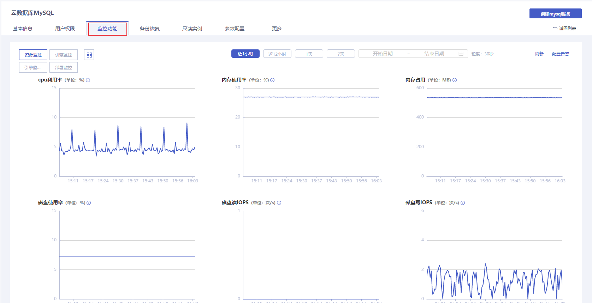

### 监控功能

#### 前置条件

您已创建云数据库 MySQL 实例，且实例正在运行。您可以通过 [云数据库 MySQL 控制台](https://console.capitalonline.net/dbinstances) 查看可视化监控指标，以掌握实例的运行信息。

> **注意**：
>
> - 单个实例的表数量超过 100 万后，可能会影响数据库监控，请合理规范表的数量，控制单个实例表数量不超过 100 万。
> - 支持的实例类型：MySQL 基础版、主从版、只读实例
> - 目前云数据库 MySQL 最长支持查看 **90天** 前的监控数据。
>

#### 控制台查看

##### 操作步骤

1. 进入 [云数据库 MySQL 控制台](https://console.capitalonline.net/dbinstances)，点击实例的名称进入到实例管理页面，点击 **监控功能** 查看账号列表，或从更多操作中选择 **监控功能** 进入。

2. 在监控功能页面，查看云数据库 MySQL 监控。

   

3. 更多云数据库 MySQL 监控指标介绍，详情参见 [监控指标说明](./01.监控指标说明.md)。

#### API查看

通过 API 查看云数据库 MySQL 监控，详情参见 [查询云数据库MySQL监控](./../../08.API文档/07.监控相关接口/00.查询云数据库MySQL监控.md)。
