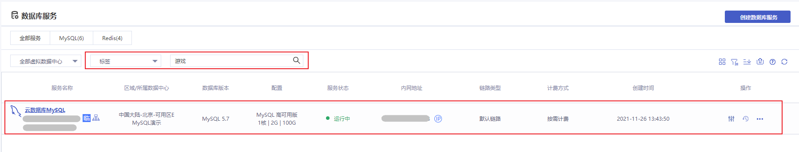

### 标签概述

#### 标签简介

如果您有大量实例，可以通过给实例绑定标签，来对实例进行分类管理。

> **注意**：
>
> - 最多可以添加 19 个标签
> - 每个实例最多能绑定 19 个标签
>

#### 标签案例

公司A 在首云上创建了 5 台云数据库 MySQL，分属电商、游戏、金融三个业务方向，三个业务方向对应的运维负责人为张三、李四、王五。

#### 设置标签

为了方便管理，公司A 使用标签来分类管理对应的云数据库 MySQL 资源，定义了电商、游戏、金融、张三、李四、王五等标签。

将标签对应 5 台云数据库 MySQL 实例后，可以方便的通过标签筛选对应实例，对实例进行分类管理。

#### 使用标签

编辑云数据库 MySQL 标签方法详情参见 [编辑标签](./01.编辑标签.md)。
