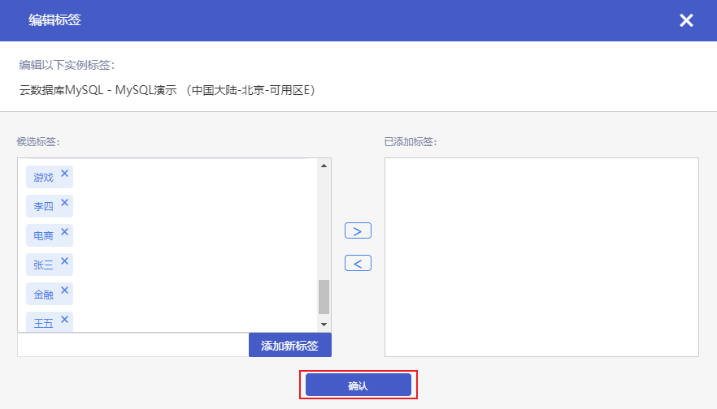
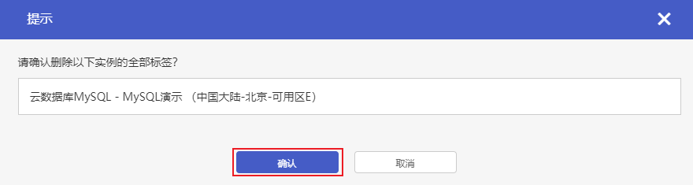

您可以对您的云数据库 MySQL 实例进行标签的编辑操作。

## 编辑标签

### 操作步骤

1. 进入 [云数据库 MySQL 控制台](https://console.capitalonline.net/dbinstances)，点击实例的名称进入到实例管理页面，点击 **更多** > **编辑标签**，或从更多操作中选择 **编辑标签** 进入。

2. 在弹出的 **编辑标签** 窗口中，可对该实例进行添加、删除标签操作，确认无误后点击 **确认** 即可。

   

## 批量删除标签

### 操作步骤

1. 进入 [云数据库 MySQL 控制台](https://console.capitalonline.net/dbinstances)，点击实例的名称进入到实例管理页面，点击 **更多** > **删除标签**，或从更多操作中选择 **删除标签** 进入。

2. 在弹出的确认窗口中，点击 **确认** 即可删除该实例的全部标签。

   
