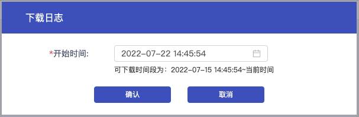
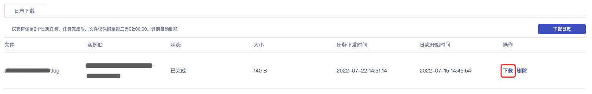

您可以在控制台下载云数据库 MySQL 的慢日志文件。

> **注意**：
>
> - 日志下载会生成日志任务，当状态为 **已完成** 时，可在操作列进行下载或删除。
> - 最多支持下载 7 天内慢日志。
> - 仅支持保留 2 个日志任务，任务完成后，文件仅保留至第二天 02:00:00，过期自动删除。
> - 您的全部 MySQL 实例的日志下载任务将统一展示在列表中，可通过实例 ID 进行区分。

## 慢日志下载

1. 进入 [云数据库 MySQL 控制台](https://console.capitalonline.net/dbinstances)，点击实例的名称进入到实例管理页面，点击 **更多** > **慢日志下载**，或从更多操作中选择 **慢日志下载** 进入。

2. 在日志下载页面中，点击 **下载日志** 。

   

3. 在弹出的窗口中，选择要下载的慢日志开始时间，选择完成后，点击 **确认**。

   

4. 待下载任务状态变为已完成，点击操作中的 **下载** 即可下载慢日志文件。

   
