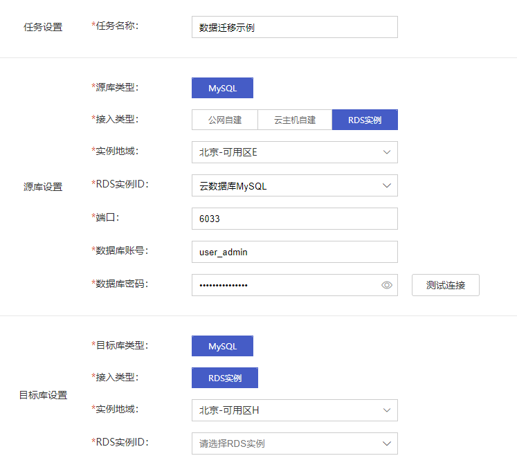

## 操作场景

当您想要将云数据库 MySQL 实例迁移至其他虚拟数据中心，可以使用 [数据传输工具 DTS](https://console.capitalonline.net/dts) 进行数据迁移操作。

## 操作步骤

1. 进入 [云数据库 MySQL 控制台](https://console.capitalonline.net/dbinstances)，在想要迁移的虚拟数据中心下创建目标实例，创建实例步骤详情参见 [创建实例](./../04.操作指南/02.管理实例/00.创建实例.md)。

2. 登录 [数据传输工具 DTS 控制台](https://console.capitalonline.net/dts)，在左侧导航选择 **数据迁移**，单击 **新建迁移任务** ，进入新建数据迁移任务页面。

   

3. 根据页面提示创建 DTS 任务，数据迁移任务操作步骤，详情参见 [DTS迁移操作](https://gic-help.capitalonline.net/cn/doc/dts/%E6%95%B0%E6%8D%AE%E5%BA%93%E8%BF%81%E7%A7%BB%E6%93%8D%E4%BD%9C)。

4. 迁移完成后，将业务数据库切换至目标数据库。
